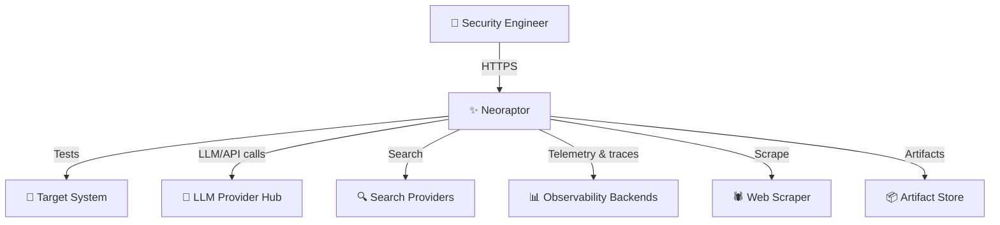
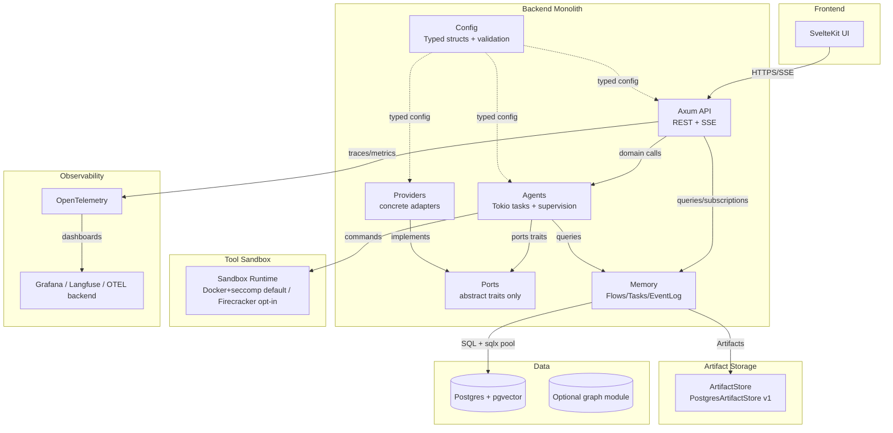

# Neoraptor

> **A Rust-powered engine for automated penetration testing and offensive reconnaissance.**

**NEO** references The Matrix — "the One" who sees the truth behind the illusion, like a pentester revealing the real state behind dashboards and firewalls.

**RAPTOR** evokes a fast, precise predator, matching Rust’s performance profile and our goal: hunt vulnerabilities quickly, safely, and intelligently.

Together, **NEORAPTOR** stands for a new kind of hunter in the matrix of modern infrastructure: Rust-fast, automation-first, and built for serious offensive security work.

We keep the core conceptual model from earlier iterations but rebuild the system as a Rust workspace monolith with strict boundaries, safer execution, clearer supervision, and simpler infrastructure.

Rust version 1.95.0.

***

## 1. Top-Level Project Layout

Cargo workspace monorepo with explicit domain crates:

```text
neoraptor/
├── Cargo.toml                   # workspace
├── .cargo/
│   └── config.toml              # workspace-level clippy lints enforced via [build] rustflags
├── deny.toml                    # cargo-deny: ban unwrap/expect in production crates, audit deps
├── crates/
│   ├── api/                     # Axum HTTP/REST + SSE app (composition root, no business logic)
│   ├── agents/
│   │   ├── agents-core/         # traits, policies, message types, typestates, supervision contracts
│   │   │                        # NEW: ScopeContract, CoverageMap, GapfillPolicy, ValidatorMessage,
│   │   │                        #      PendingFinding, ConfirmedFinding, DisputedFinding, ChainHypothesis entry point
│   │   └── agents-impl/         # OrchestratorActor, ResearcherActor, DeveloperActor, ExecutorActor, MentorActor, PlannerActor
│   │                            # NEW: ValidatorActor, ChainPlannerActor
│   ├── ports/                   # abstract traits only (LlmProvider, SearchProvider, EventBus, SandboxRuntime,
│   │                            #   SummarizationStrategy, ArtifactStore, WebScraperPort, KnowledgeGraphPort)
│   ├── providers/               # concrete adapters implementing ports/ traits
│   │                            # (OpenAI, Anthropic, Ollama, Perplexity, OTEL backends, optional LangfuseExporter)
│   ├── memory/                  # flows/tasks/subtasks/actions/memory domain + event log + summarization
│   │                            # NEW: ChainHypothesis domain type, CoverageMap persistence
│   ├── tools/                   # pentest tool abstractions + sandbox orchestration
│   │                            # NEW: ProbeSpec<P>, ProbeDeduplicator, ProbeProtocol trait
│   ├── db/                      # Postgres/pgvector adapters, migrations, repositories (sqlx offline mode)
│   │                            # NEW: ProbeSpecRepository
│   └── config/                  # typed configuration structs; startup validation; secrets via `secrecy`
│                                # NEW: ScopeContractConfig, validator LLM provider selection
├── frontend/                    # SvelteKit UI (auth, dashboards, run views, audit screens)
├── infra/                       # Docker Compose, observability, sandbox runtime
│   ├── docker-compose.yml       # defines control-net, execution-net, observability-net
│   └── sandbox/                 # versioned Docker / Firecracker profiles, seccomp policies
├── docs/
│   ├── adr/                     # Architecture Decision Records (ADR-001 onward; ADR-002+ stubs)
│   ├── threat-model.md
│   ├── guides/
│   │   ├── firecracker-setup.md
│   │   ├── provider-config.md
│   │   └── two-node-deploy.md
│   └── runbooks/
└── justfile                     # `just prepare-sqlx`, `just lint`, `just test`, `just dev`
```

### What this layout fixes

- Clear **compile-time boundaries** between API, agents, memory, tools, DB, and configuration.
- Splitting `agents/` into `agents-core/` and `agents-impl/` prevents it from becoming a god crate as actor count grows.
- A dedicated **`ports/`** crate holds abstract traits only; `agents`, `memory`, and `tools` depend on `ports/`, never on `providers/` directly.
- A dedicated `providers/` crate holds all concrete adapters, so swapping providers is wiring and config, not refactoring.
- A dedicated `config/` crate is the single source of typed configuration, eliminating env-var sprawl.
- `docs/adr/` has ADR-001 (async trait strategy) plus ADR-002 (sandbox network topology), ADR-003 (artifact storage strategy), ADR-004 (search provider config pattern) as stubs with `Status: Proposed` to record early architectural decisions.
- `docs/guides/` provides operator-focused guides for Firecracker, provider configuration, and two-node deployment.
- Rust’s safety model plus a server-rendered UI reduces entire classes of bugs common in looser backend/frontend stacks.

***

## 2. System Context

We are explicit about what the system **owns** vs what it **integrates**:



### Key design principles

- LLM, search, summarization, sandbox, observability, web scraping, and artifact storage are **pluggable ports** from day one.
- Pentest tools and target access are reachable **only** through the sandbox layer.
- Secrets are never stored as plain strings in long-lived application state; they are wrapped in `secrecy::Secret<T>` at config boundaries.
- UI authentication and auditability are first-class concerns because operator access is part of the security boundary, not just a product feature.
- **Scope authorization is a type-system invariant, not a runtime prompt convention** — `ScopeContract` is the only legal entry point for `Intent::validate()`.

***

## 3. Core Container Architecture

We use a slim core container architecture with no message queue until it is actually justified.



### Container-level improvements

- **No MQ service initially**: internal Tokio channels handle in-process coordination; we only add Kafka or RabbitMQ when a measured need appears.
- **Neo4j is optional**: we default to Postgres + pgvector; graph storage remains behind a trait.
- **REST + SSE instead of GraphQL**: SSE is a consumer of persisted events, not the source of truth.
- **Observability is composable**: all signals go through `tracing` + `opentelemetry` with optional Langfuse-exported LLM traces.
- **Event streaming is persistence-backed**: SSE resumes from durable event IDs rather than transient actor state.
- **Connection pooling is explicit**: `sqlx`’s built-in pool is configured via typed `DatabasePoolConfig` in `config/`.

***

## 4. Crate Dependency Graph

Strict layering prevents circular and diamond dependencies:

```text
config ──► ports ──► memory
                  ├──► agents-core
                  └──► tools

providers ──(implements)──► ports
db ───────────────────────► ports (persistence repository traits)

agents-impl ──► agents-core
            ├──► memory
            └──► ports

api ────────► agents-impl
          ├──► memory
          └──► providers
```

> **Rule**: only `api/` and executable entrypoints may import `providers/`. All other crates depend on `ports/` traits only.

### Boundary rules

- `ports/` stays intentionally small and stable and does **not** depend on `config/`.
- `providers/` owns HTTP clients, retries, backoff, serialization quirks, and third-party SDK glue.
- `db/` depends on thin repository interface traits defined in `ports/`, never directly on `memory/` domain types.
- `api/` is the composition root where concrete providers are wired into abstract traits; business logic must remain outside `api/src/bootstrap.rs`.
- `memory/` depends on `SummarizationStrategy` from `ports/` — never directly on `LlmProvider`; concrete summarization implementations live in `providers/`.

***

## 5. ADR-001: Async Trait Object Strategy

**Decision (non-negotiable, applies to all of `ports/`):** on Rust 1.95, native `async fn` in traits is stable but does not automatically yield `Send` futures when used as `dyn Trait`.
We solve this with **`trait_variant::make`** from the [`trait-variant`](https://crates.io/crates/trait-variant) crate.

Every provider trait in `ports/` is declared with a `Send`-bound variant using `#[trait_variant::make(TraitName: Send)]`.

```rust
// ports/src/llm.rs

#[trait_variant::make(LlmProvider: Send)]
pub trait LocalLlmProvider {
    async fn complete(&self, req: &CompletionRequest) -> Result<CompletionResponse, LlmError>;
    async fn embed(&self, text: &str) -> Result<Arc<[f32]>, LlmError>;
}

// ports/src/search.rs

#[trait_variant::make(SearchProvider: Send)]
pub trait LocalSearchProvider {
    async fn search(&self, query: &str) -> Result<Vec<SearchResult>, SearchError>;
}

// ports/src/sandbox.rs

#[trait_variant::make(SandboxRuntime: Send)]
pub trait LocalSandboxRuntime {
    async fn run(
        &self,
        profile: &SandboxProfile,
        cmd: ValidatedCommand,
        cancel: CancellationToken,
    ) -> Result<RawOutput, SandboxError>;
}

// ports/src/summarization.rs

#[trait_variant::make(SummarizationStrategy: Send)]
pub trait LocalSummarizationStrategy {
    async fn summarize(&self, chain: &Chain, config: &SummarizerConfig) -> Result<Chain, SummarizationError>;
}
```

**Rules derived from this decision:**

- `Arc<dyn LlmProvider>` is always `Arc<dyn LlmProvider + Send + Sync>`.
- `agents-impl/` and `tools/` hold `Arc<dyn LlmProvider>`, never `Box<dyn LocalLlmProvider>`.
- We do not use the `async_trait` macro anywhere; it is banned in `deny.toml`.
- `embed` returns `Arc<[f32]>` directly from the trait, not `Vec<f32>`.
- `complete` takes `req: &CompletionRequest` by reference; callers clone only when needed.
- Any new trait added to `ports/` must follow this pattern.

***

## 6. Domain Model

The original ERD remains useful but is embedded into Rust domain crates.

- **`memory` crate** owns `Flow`, `Task`, `SubTask`, `Action`, `Artifact`, `MemoryEntry`, and domain services.
- **`db` crate** implements persistence repository traits defined in `ports/` using `sqlx` with offline mode.
- The **`EventBus`** trait is defined in `ports/`; the default implementation is a Postgres-backed append-only event log.
- SSE subscribes to persisted events, not directly to actor mailboxes.

```text
Flow → Task → SubTask → Action → (Artifact, MemoryEntry)
                                  ↓
                          EventLog (append-only, replayable)
```

### Design decisions

- **No JSON blobs for stable fields**: we use structured columns for stable data and indexes.
- **Audit fields are first-class**: `approved_by`, `approved_at`, `approved_from`, `reason`, and similar fields are typed columns.
- **Memory limits are typed config**: token budgets, retention, and summarization thresholds live in `config/`.
- `AgentMessage` uses tagged enums with large variants boxed, enforced by `clippy::large_enum_variant = "deny"`.
- Event payloads stored in Postgres are the durable record; streaming layers send references or compact payloads, not arbitrary blobs.

### Event log strategy

The default Postgres event bus is designed around **append + read-by-cursor**, not transient notifications.

- Writers append immutable events with monotonic IDs.
- Readers resume with `last_seen_event_id`.
- SSE uses cursor-based replay and catch-up semantics.
- Authorization is re-evaluated on **every cursor resume**.
- `LISTEN/NOTIFY` is a wake-up hint only; fallback polling interval is 500 ms.
- The Postgres connection pool is sized for concurrent `LISTEN` connections and configured via `DatabasePoolConfig`.

### CI: sqlx offline mode

We run `just prepare-sqlx` before adding new queries; `.sqlx/` is committed and cached in CI so contributors do not need a live database to compile.

***

## 7. Agents and Supervision

`agents/` is split into two sub-crates to keep contracts separate from implementations.

### `agents-core/`

- `AgentMessage` enum: all inter-agent communication uses typed messages; large payload variants are boxed.
- `ToolCallPolicy`: configurable per flow, unit-testable, startup-validated.
- `LoopDetectionPolicy`: runs on a sliding window of `AgentMessage` events delivered via a dedicated channel to `MentorActor`.
- `ExecutionLimits`: max duration, max cost, max actions, retry budget, and escalation behavior.
- `SupervisorPolicy`: defines restart strategy, backoff schedule, and failure propagation rules.
- **Typestate for command validation**: unvalidated intent cannot reach the sandbox API.

```rust
pub struct Intent(pub String);

pub struct ValidatedIntent(String);

pub struct ValidatedCommand(/* sandbox-safe fields */);

pub struct NonEmptyToolPolicy {
    allowed_tools: Vec<String>, // sealed, startup-validated, non-empty
}

impl Intent {
    pub fn validate(self, policy: &NonEmptyToolPolicy) -> Result<ValidatedIntent, PolicyError> {
        // allowlist check
    }
}

impl ValidatedIntent {
    pub fn into_command(self, plan: &ExecutionPlan) -> Result<ValidatedCommand, PolicyError> {
        // consumes self
    }
}
```

> **Security invariant**: `ValidatedIntent` can only be constructed via `Intent::validate`, and `ValidatedCommand` is not `Clone`.

- `CancellationToken` is threaded through every actor and every sandbox task.
- Trace context is part of the message envelope so spans remain connected.

### `agents-impl/`

- **`OrchestratorActor`**: owns flow lifecycle, task assignment, and policy enforcement; reads `CoverageMap` and uses `GapfillPolicy` to re-queue under-covered `ProbeSpec` instances.
- **`ResearcherActor`**: recon, search, and document gathering.
- **`DeveloperActor`**: drafts exploit steps, scripts, and reports; assists authoring of `ProbeSpecDraft` instances.
- **`ExecutorActor`**: runs tools via `tools/`, records `Action` + `Artifact`, emits events.
- **`MentorActor`**: consumes `AgentMessage` events; runs `LoopDetectionPolicy` in memory; writes to Postgres on policy breach.
- **`PlannerActor`**: mission decomposition and replanning.
- **`Reflector`**: post-step analysis.
- **`ValidatorActor`**: adversarial review peer using `ValidatorMessage` and a separately configured LLM provider.
- **`ChainPlannerActor`**: consumes `ConfirmedFinding` records and synthesizes `ChainHypothesis` via graph traversal or pgvector similarity.

### Supervision model

Neoraptor uses Tokio tasks with **explicit structured supervision**.

- Every long-lived actor is registered in an `ActorRegistry`.
- The registry owns `JoinHandle<Result<(), ActorError>>` per actor.
- On completion, the registry checks `JoinError::is_panic()` and applies `SupervisorPolicy`.
- In-flight work is retried, marked failed, or escalated to operator review.
- Panics are captured via `catch_unwind` in actor wrappers; internal spawned tasks must also be supervised.

### RootSupervisor

A `RootSupervisor` entry point in `api/src/bootstrap.rs` owns the top-level `OrchestratorActor` handle and the `ActorRegistry`.

- Starts `OrchestratorActor` and all child actors.
- Restarts `OrchestratorActor` according to `SupervisorPolicy` on unrecoverable panic.
- Decides state recovery: replay from event log, mark flows as failed, or require operator intervention.

### Provider dispatch decision

Built-in providers (`OpenAiAdapter`, `AnthropicAdapter`, `OllamaAdapter`, `PerplexityAdapter`) are dispatched via a **closed-set `enum BuiltinLlmProvider`** in `providers/`, while custom providers use `Arc<dyn LlmProvider>`.

***

## 7a. ValidatorActor — Adversarial Review Stage

`ValidatorActor` is a permanently non-emitting peer in `agents-impl/`.
Its contract is enforced by type: it receives a `PendingFinding` and can only return `ConfirmedFinding` or `DisputedFinding`.

```rust
// agents-core/src/findings.rs

pub enum ValidatorMessage {
    Confirm(ConfirmedFinding),   // advances to ChainPlannerActor → report
    Dispute(DisputedFinding),    // routes to MentorActor for escalation
}
// ValidatorMessage deliberately does NOT include a variant that creates new findings.
```

- `ValidatorActor` is configured via `config/` to use a **different** LLM provider than `ExecutorActor`, maximizing adversarial signal.
- It receives only the finding record and the `ProbeSpec` that generated it — no full session context — forcing evidence-based reasoning.
- The wrong outbound message type becomes a **compile-time error**, not a harness convention.

**Crate placement:** `agents-core/` (ValidatorMessage, PendingFinding, ConfirmedFinding, DisputedFinding), `agents-impl/ValidatorActor`, `config/` (validator LLM provider selection).

***

## 7b. ChainPlannerActor — Multi-Primitive Exploit Chain Synthesis

`ChainPlannerActor` in `agents-impl/` consumes `ConfirmedFinding` records from the event log and reasons across multiple primitives to construct multi-step exploit chains.

```text
ConfirmedFinding(A) + ConfirmedFinding(B) → ChainHypothesis
ChainHypothesis → ValidatedIntent (chain execution plan)
→ ExecutorActor → PoC execution → ChainArtifact
```

- Operates in `memory/` graph space via `KnowledgeGraphPort` when enabled; falls back to pgvector similarity search when the graph DB is absent.
- Outputs a `ChainHypothesis` domain type in `memory/` that must survive the full typestate pipeline before any action is taken.
- Chain planning survives context window limits and model restarts because it works on durable, cursor-resumable event log records.

**Crate placement:** `agents-impl/ChainPlannerActor`, `memory/` (ChainHypothesis domain type + event log queries), `ports/KnowledgeGraphPort`, `agents-core/` (ChainHypothesis typestate entry).

***

## 8. Error Handling Strategy

Error handling is treated as an architectural concern.

### `ports/` error types — required variants

```rust
#[derive(Debug, thiserror::Error)]
pub enum LlmError {
    #[error("rate limited; retry after {retry_after:?}")]
    RateLimit { retry_after: Option<Duration> },
    #[error("context window exceeded ({tokens_used} tokens used)")]
    ContextWindowExceeded { tokens_used: usize },
    #[error("authentication failure")]
    AuthFailure,
    #[error("request timed out after {elapsed:?}")]
    Timeout { elapsed: Duration },
    #[error("provider unavailable")]
    Unavailable { reason: UnavailableReason },
    #[error(transparent)]
    Upstream(#[from] Box<dyn std::error::Error + Send + Sync>),
}

#[derive(Debug, Clone, PartialEq, Eq)]
pub enum UnavailableReason {
    ServiceDown,
    CapacityExceeded,
    RegionUnavailable,
    Unknown,
}

#[derive(Debug, thiserror::Error)]
pub enum SandboxError {
    #[error("execution timed out")]
    Timeout,
    #[error("policy violation: {0}")]
    PolicyViolation(String),
    #[error("sandbox spawn failed: {0}")]
    SpawnFailure(String),
    #[error("cancelled")]
    Cancelled,
}

#[derive(Debug, thiserror::Error)]
pub enum PolicyError {
    #[error("tool '{tool}' not in allowlist")]
    ToolNotAllowed { tool: Arc<str> },
}
```

`OrchestratorActor` matches on these variants to decide retry, abort, or escalation behavior.

### Workspace rules

- Library crates expose typed errors with `thiserror`; `anyhow` is banned in `ports/`, `agents-core`, `memory`, `tools`, and `db`.
- `anyhow` is allowed only in `api/`.
- `unwrap()`, `expect()`, and `panic!()` are banned in production crates except in startup validation or unreachable branches with `// SAFETY:` comments.
- Error propagation uses typed mapping (`map_err`) without stringifying structured context.

***

## 9. Secret Management

All secrets are treated as first-class typed values.

```rust
use secrecy::Secret;

pub struct LlmModelConfig {
    pub primary: String,
    pub secondary: Option<String>,
    pub embedding: String,
}

pub struct LlmConfig {
    pub provider: LlmProviderKind,
    pub api_key: Secret<String>,
    pub base_url: Option<String>,
    pub models: LlmModelConfig,
}

pub struct DatabaseConfig {
    pub url: Secret<String>,
    pub pool: DatabasePoolConfig,
}

pub struct DatabasePoolConfig {
    pub min_connections: u32,      // default: 2
    pub max_connections: u32,      // default: 10
    pub acquire_timeout_secs: u64, // default: 5
    pub idle_timeout_secs: u64,    // default: 600
}

pub struct ProxyConfig {
    pub url: Option<Secret<String>>,
    pub no_proxy: Vec<String>,
}
```

### Rules

- `figment` deserializes config; secrets are wrapped in `Secret<T>` immediately.
- Secrets never appear in logs or spans.
- `DatabaseConfig.url` is exposed to `sqlx` via a narrow `db/src/connect.rs` boundary; `expose_secret()` must not be called elsewhere.
- `expose_secret()` call sites are enforced by CI (grep or custom Clippy).
- Functions receiving secret-bearing types must use `#[instrument(skip(cfg))]` or equivalent `skip(...)` attributes; CI verifies this.

***

## 10. Memory and Summarization

Summarization remains within `memory/` until it justifies a split.

- Encapsulates `ChainAST` and strategies: `SectionSummary`, `QaSummary`, `KeepLastN`.
- API: `summarize_chain(chain: &Chain, strategy: &dyn SummarizationStrategy, config: &SummarizerConfig) -> Chain`.
- `SummarizerConfig` lives in `config/` with startup validation.

### Memory allocation policy

- `RawOutput` is `bytes::Bytes` for zero-copy cloning across actors and storage.
- Embeddings are `Arc<[f32]>` from `LlmProvider::embed` (ADR-001).
- Large `AgentMessage` variants are boxed, enforced by `large_enum_variant = "deny"`.
- Large tool output is stored separately from compact event records so the event stream stays light.

***

## 11. Tools and Sandbox

`tools/` defines tool planning, execution, and parsing using the `Send`-variant traits.

```rust
#[trait_variant::make(PentestTool: Send)]
pub trait LocalPentestTool {
    fn name(&self) -> &str;
    async fn plan(&self, intent: &ValidatedIntent) -> Result<ExecutionPlan, PolicyError>;
    async fn execute(
        &self,
        plan: &ExecutionPlan,
        runtime: &dyn SandboxRuntime,
        cancel: CancellationToken,
    ) -> Result<RawOutput, SandboxError>;
    async fn parse_result(&self, output: RawOutput) -> Result<StructuredResult, SandboxError>;
}
```

### Critical security design

**Tools never run directly from LLM text.**

```text
LLM text → Intent → ScopeContract::authorize() → ValidatedIntent → ExecutionPlan → ValidatedCommand → SandboxRuntime
```

Each step is a distinct type; skipping validation becomes a compile-time error.
`ScopeContract` is the authorization gate prepended to the existing typestate pipeline.

### Policy hardening

- `ToolCallPolicy` is startup-validated; empty policies are rejected at startup.
- Profile selection, network rules, and allowed tools are enforced before sandbox invocation.
- High-risk actions require operator approval, recorded in audit columns.

### Sandbox hardening

- **Default**: Docker + seccomp, non-root, read-only filesystem, explicit network policies, resource limits.
- **Opt-in**: Firecracker microVMs when KVM is available; if configured but unavailable, we refuse to start unless `sandbox.firecracker_unavailable_fallback = "docker"` is set, logging a `WARN` on every startup.
- Profiles are versioned under `infra/sandbox/`.
- Every invocation carries a `CancellationToken` tied to `ExecutionLimits.max_duration`.
- Sandbox stdout/stderr, exit code, duration, profile, and resource usage are recorded as structured `Artifact` records.

***

## 11a. ProbeSpec — Typed Vulnerability Specification Layer

`ProbeSpec<P>` in `tools/` replaces runtime-interpreted YAML/Jinja skill templates with Rust domain types.
`P` is a phantom type representing the probe’s protocol class.

```rust
// tools/src/probe.rs

pub struct ProbeSpec<P: ProbeProtocol> {
    pub id: ProbeId,                         // stable UUID, versioned
    pub target_class: TargetClass,
    pub risk_level: RiskLevel,
    pub preconditions: Vec<Precondition>,
    pub steps: Vec<ProbeStep>,               // typed variants, not YAML strings
    pub expected_indicators: Vec<Indicator>,
    pub requires_poc: bool,
    _protocol: PhantomData<P>,
}
```

- Probe authoring uses a Rust builder API; LLMs assist by proposing `ProbeSpecDraft` (unvalidated) and `ProbeSpec` is constructable only after `ProbeSpecValidator` confirms structural validity.
- Validated specs are stored as typed records in `db/` via `ProbeSpecRepository`, not YAML files on disk.
- **Probe deduplication**: before sandbox invocation, `ProbeDeduplicator` merges `ProbeSpec` instances with identical `(target_class, ProbeStep sequence)` fingerprints so one network request serves all matching specs.
- Structural invalidity in a probe spec is caught at `ProbeSpecValidator` time before any execution.

**Crate placement:** `tools/` (ProbeSpec, ProbeDeduplicator, ProbeProtocol), `db/` (ProbeSpecRepository), `agents-impl/DeveloperActor` (ProbeSpecDraft authoring), `agents-core/` (RiskLevel, Indicator, Precondition).

***

## 11b. ScopeContract — Typed Governance Layer

`ScopeContract` in `agents-core/` is the only type that can authorize a `ValidatedIntent`.
It is constructed from operator-approved configuration at startup and cannot be cloned or bypassed.

```rust
// agents-core/src/scope.rs

pub struct ScopeContract {
    pub allowed_targets: Arc<[Target]>,          // non-empty, startup-validated
    pub excluded_paths: Arc<[ExcludedPath]>,
    pub requires_approval_above: RiskLevel,
    pub valid_until: DateTime<Utc>,              // time-bounded authorization
    pub authorization_id: Uuid,                  // every action traces to an authorization event
}
// ScopeContract is NOT Clone.
```

The extended typestate pipeline becomes:

```text
RawGoal → ScopeContract::authorize() → Intent → ValidatedIntent → ExecutionPlan → ValidatedCommand → SandboxRuntime
```

- `ScopeContract` is constructed only via `ScopeContractBuilder`, which validates all fields against `config/scope.toml` at startup.
- `authorization_id` is written as a structured column on every event log entry, making every action traceable to a specific operator authorization.
- Unauthorized scope is treated as a startup-time error, not a runtime model decision.

**Crate placement:** `agents-core/` (ScopeContract, ScopeContractBuilder, RiskLevel), `config/` (ScopeContractConfig + validation), `memory/` (authorization audit event record), `api/` (approval gate endpoint).

***

## 11c. CoverageMap and GapfillPolicy — Coverage-Aware Replanning

`CoverageMap` in `agents-core/` tracks which `(TargetComponent, AttackClass)` pairs have been attempted and what their outcomes were.

```text
CoverageMap tracks per pair:
  - ConfirmedFinding
  - DisputedFinding
  - NoFinding
  - Touched but not covered thoroughly (flagged by ExecutorActor)
```

- `OrchestratorActor` reads `CoverageMap` at the start of each planning cycle.
- `GapfillPolicy` re-queues `ProbeSpec` instances for under-covered areas, counteracting model drift toward previously successful attack classes.
- `CoverageMap` state is persisted in the event log and is cursor-resumable.

**Crate placement:** `agents-core/` (CoverageMap, GapfillPolicy), `agents-impl/OrchestratorActor` (coverage-aware replanning), `memory/` (CoverageMap persistence).

***

## 12. Control Plane vs Execution Plane

Neoraptor explicitly separates **control plane** and **execution plane** as a first-class concept.

### Logical separation

- **Control plane**: API, agents, memory, DB, config, observability, UI.
- **Execution plane**: sandbox runtime and tool containers.

The `SandboxRuntime` port trait is the **only** allowed crossing point.

### Physical topology (Docker networks)

`infra/docker-compose.yml` defines three Docker networks:

- `control-net`: API, agents, DB, memory, providers, frontend.
- `execution-net`: sandbox runtime and tool containers (no direct DB or API access).
- `observability-net`: OTEL backend, Grafana, optional Langfuse.

Rules:

- API and DB join `control-net` only.
- Sandbox runtime joins `execution-net` only (plus `observability-net` for telemetry).
- No direct routing between `control-net` and `execution-net`; only the `SandboxRuntime` port crossing is allowed.

ADR-002 records this sandbox network topology.

***

## 13. UI, Auth, and Auditability

Neoraptor is a security product; the UI is part of the trusted boundary.

### UI rules

- Auth is mandatory for all operator surfaces; unauthenticated requests receive `401`.
- SSE streams are scoped to authenticated sessions and authorized runs.
- Authorization is re-checked on every cursor resume.
- Sensitive data is never emitted to unauthenticated or over-broad channels.
- CSRF protection, session fixation prevention, and role-based access boundaries live in Axum middleware and are documented in the threat model.

### Auditability

- Operator approvals, overrides, and interventions are persisted as structured records (`approved_by`, `approved_at`, `approved_from`, `reason`).
- Every event carries a `ScopeContract.authorization_id` linking it to the originating authorization record.
- `ChainHypothesis` and `ConfirmedFinding` records are first-class event log entries, queryable for audit and replay.
- High-risk executions are traceable from operator request to report.
- Audit screens ship in the initial SvelteKit UI scope.

***

## 14. Observability and LLM Tracing

Observability must preserve causality across agents, providers, and sandbox runs.

### Rules

- All components emit spans and metrics via `tracing` + OpenTelemetry.
- Trace context is part of every `AgentMessage` envelope.
- Tool runs, provider calls, DB operations, and policy decisions emit structured fields.
- Sensitive fields are redacted by design (`expose_secret()` is constrained and `#[instrument(skip(...))]` is enforced).

### Required signals

We emit metrics for:

- Flow/task/action durations.
- Tool execution count, duration, exit status, sandbox profile.
- Provider latency, token usage (prompt + completion), retry counts, error variant.
- Event log append lag and SSE catch-up lag.
- Actor restart count and failure reason.
- Sandbox cancellations, timeouts, policy violations.
- `LlmError::RateLimit` rate per provider.
- `CoverageMap` coverage percentage per `(TargetComponent, AttackClass)` pair.
- `ProbeDeduplicator` deduplication ratio (sandbox invocations saved).
- `ValidatorActor` confirm/dispute ratio per probe class.
- `ChainPlannerActor` chain hypotheses generated and advanced to PoC.

### LLM observability (Langfuse)

We expose LLM call tracing via an optional `LangfuseExporter` in `providers/`.

- Enabled only when `LANGFUSE_*` config is present.
- Exports LLM spans and token metrics through OTel-compatible signals.
- There is no hard dependency on Langfuse; default deployment uses standard OTEL backends.

ADR-003 documents this as part of the LLM observability and artifact strategy.

***

## 15. Configuration Structure

Neoraptor uses a typed `config/` crate with `figment` + `Secret<T>` and avoids env-var sprawl.

### LLM config

- `LlmConfig` includes `LlmProviderKind`, `api_key`, `base_url`, and `LlmModelConfig` (`primary`, `secondary`, `embedding`).
- Per-provider model config is typed so each provider can define different primary/secondary/embedding models.
- `ValidatorActor` LLM provider is configured separately via `config/` to ensure adversarial independence.

### Search config

Neoraptor defines a `SearchConfig` struct with a typed `SearchProviderKind` enum and per-provider API key fields using `Secret<T>`.

- Supported providers include Tavily, Traversaal, Perplexity, DuckDuckGo, Google, Sploitus, and Searxng.
- `SearchProviderKind` selects the active provider; additional providers can be added via new enum variants.
- `SearchConfig` lives in `config/` and is wired into `providers/` search adapters.

### ProxyConfig

A global `ProxyConfig` supports enterprise and air-gapped deployments.

- `ProxyConfig { url: Option<Secret<String>>, no_proxy: Vec<String> }`.
- Threaded through provider HTTP client construction in `providers/`.
- Allows per-deployment override while maintaining a consistent shape.

### ScopeContractConfig

```toml
# config/scope.toml
[scope]
allowed_targets   = ["10.0.0.0/24"]
excluded_paths    = ["/admin/backup"]
requires_approval_above = "High"
valid_until       = "2025-12-31T23:59:59Z"
```

This is validated at startup by `ScopeContractBuilder`; missing or empty `allowed_targets` is a hard startup failure.

***

## 16. Web Scraping and Knowledge Graph

Web intelligence is a core pentest capability.

### WebScraperPort

- `WebScraperPort` trait is defined in `ports/`.
- The default implementation calls a Firecrawl API or an adopted external service.
- Alternate implementations can point to a self-hosted scraper container.
- Configured via `ScraperConfig` in `config/`.

### KnowledgeGraphPort

- `KnowledgeGraphPort` lives in `ports/`.
- A Neo4j-based implementation in `providers/` is fully optional.
- Default deployment runs without any graph DB; Postgres + pgvector is sufficient.
- `ChainPlannerActor` uses `KnowledgeGraphPort` for chain traversal when available and falls back to pgvector similarity otherwise.

***

## 17. Artifact Storage

Neoraptor introduces an `ArtifactStore` port from v1.

### ArtifactStore port

- `ArtifactStore` trait lives in `ports/`.
- Default implementation: `PostgresArtifactStore` storing `RawOutput` as `bytes::Bytes` in Postgres.
- This abstraction allows us to swap to S3/MinIO later via a new `S3ArtifactStore` or `MinioArtifactStore` without refactoring callers.

ADR-003 records this artifact storage strategy.

***

## 18. Infrastructure and Deployment

Neoraptor’s infra is defined under `infra/`.

### Docker networks

- `control-net`: API, agents, DB, memory, providers, frontend.
- `execution-net`: sandbox runtime and tools.
- `observability-net`: OTEL backend, Grafana, optional Langfuse.

### TLS strategy

For v1 self-hosted:

- Operators can bring their own cert (path configurable in `config/`).
- If no cert is provided, Neoraptor auto-generates a self-signed cert at startup with a `WARN` log.
- TLS termination behavior is explicitly documented; there is no implicit default.

### Rootless operation

Neoraptor targets rootless Docker.

- Uses `DOCKER_HOST` env var pointing to the Docker socket.
- Documents group permission requirements in `docs/guides/two-node-deploy.md`.
- Running as root by default is explicitly avoided.

### Firecracker + KVM availability

- If Firecracker is configured but `/dev/kvm` is unavailable, Neoraptor refuses to start unless `sandbox.firecracker_unavailable_fallback = "docker"` is set.
- This behavior is documented and logged as a security warning when fallback is enabled.

***

## 19. External Libraries and Integrations

For each integration we decide whether to build, wire, or adopt.

### Integration decisions

| Integration        | Neoraptor decision                                       |
|--------------------|----------------------------------------------------------|
| Web scraping       | **Adopt** Firecrawl or self-hosted via `WebScraperPort` |
| Search             | **Wire** via `SearchProvider` + `SearchConfig`          |
| Knowledge graph    | **Optional** via `KnowledgeGraphPort`                   |
| LLM observability  | **Optional** `LangfuseExporter` in `providers/`         |
| Embedding          | `Arc<[f32]>` embeddings from trait                      |
| Rate limiting      | In-process only; external store added when scaling      |
| Artifact storage   | `ArtifactStore` port; Postgres implementation in v1     |
| OAuth              | Post-v1; v1 uses username/password auth                 |

***

## 20. Rate Limiting and Redis

Neoraptor v1 focuses on in-process rate limiting.

- Uses in-process rate limiting driven by `LlmError::RateLimit` signals.
- Introduces rate limit policies in `config/` and `agents-core/` but no external Redis dependency.
- Documents Redis as “add when horizontal scaling or cross-request rate state is needed” in the README and `docs/guides/provider-config.md`.

***

## 21. End-to-End Autonomy Loop

### How LLMs are used

1. Operator provides a goal via SvelteKit UI.
2. `OrchestratorActor` decomposes the goal into phases and tasks, persisting them in `memory/`, and reads `CoverageMap` to assign `GapfillPolicy`-driven tasks.
3. `ExecutorActor` converts `Intent` → `ScopeContract::authorize()` → `ValidatedIntent` → `ExecutionPlan` → `ValidatedCommand` and executes via sandbox, with `ProbeDeduplicator` merging identical `ProbeSpec` fingerprints.
4. Results are stored as `Action` + `Artifact`, appended to the event log, and fed into decision-making.
5. `ValidatorActor` receives each `PendingFinding` and emits `ConfirmedFinding` or `DisputedFinding` — never new findings.
6. `ChainPlannerActor` consumes `ConfirmedFinding` records, synthesizes `ChainHypothesis` instances, and feeds them back through the typestate pipeline for PoC execution.
7. `MentorActor` consumes `AgentMessage` events and runs `LoopDetectionPolicy`; on breach, it writes an audit record and signals `OrchestratorActor`.
8. `Memory` records the full run; `DeveloperActor` drafts the report.
9. SSE streams events from the event log to the UI; authorization is re-checked on every resume.

Loop:

**plan → validate → execute → observe → [adversarial review] → [chain synthesis] → decide → record → report**

***

## 22. Workspace Lint & Enforcement Policy

All of the following are enforced at CI time.

```toml
# Cargo.toml (workspace)
[workspace.lints.clippy]
large_enum_variant    = "deny"
unwrap_used           = "deny"
expect_used           = "deny"
panic                 = "deny"

[workspace.lints.rust]
unsafe_code           = "deny"
```

```toml
# deny.toml (cargo-deny)
[[bans.deny]]
name    = "async-trait"

[[bans.deny]]
name    = "anyhow"
wrappers = ["api"]
```

Additional CI checks (via `just lint`):

- `expose_secret()` boundary lint.
- `#[instrument]` `skip(...)` enforcement for secret-bearing parameters.
- `sqlx` offline mode preparation.

***

## 23. Where Neoraptor Goes Beyond

| Dimension               | Neoraptor                                                                                                           |
| ----------------------- | ------------------------------------------------------------------------------------------------------------------- |
| Language                | Rust 1.95 + SvelteKit                                                                                               |
| Structure               | Cargo workspace with strict crate boundaries                                                                        |
| Abstract traits         | Dedicated ports/ crate                                                                                              |
| Async trait strategy    | trait_variant::make Send-bound variants (ADR-001)                                                                   |
| Agent policies          | Typed policies in agents-core                                                                                       |
| Command validation      | Typestate pipeline; non-Clone ValidatedCommand                                                                      |
| Scope governance        | ScopeContract — non-Clone, time-bounded, UUID-anchored; unauthorized scope is a startup/compile-time error          |
| Vulnerability spec      | ProbeSpec<P> typed Rust domain objects; ProbeSpecDraft → ProbeSpecValidator → ProbeSpec authoring pipeline          |
| Probe deduplication     | ProbeDeduplicator merges identical (target_class, step) fingerprints before sandbox invocation                      |
| Adversarial review      | ValidatorActor with ValidatorMessage type that cannot emit new findings; separate LLM provider                      |
| Exploit chain synthesis | ChainPlannerActor synthesizes ChainHypothesis from durable ConfirmedFinding records; survives context window limits |
| Coverage tracking       | CoverageMap + GapfillPolicy in agents-core/; coverage-aware replanning prevents agent drift                         |
| Provider dispatch       | Closed-set enum + Arc<dyn> for custom                                                                               |
| LLM error model         | Typed errors + UnavailableReason                                                                                    |
| Tool execution          | Intent → ScopeContract → validated command → sandbox                                                                |
| Sandbox                 | Docker+seccomp, Firecracker opt-in                                                                                  |
| Cancellation            | CancellationToken through all actors + sandbox                                                                      |
| Secret handling         | Secret<T>; expose_secret() CI-enforced                                                                              |
| #[instrument] safety    | CI-enforced skip(...) on secret-bearing params                                                                      |
| Streaming               | Cursor-based SSE; 500 ms fallback poll                                                                              |
| Config                  | Typed config + startup validation                                                                                   |
| Supervision             | Actor registry + JoinHandle<Result<(), ActorError>>                                                                 |
| Loop detection          | Bounded channel + sliding window policy                                                                             |
| Enum payloads           | large_enum_variant = "deny"                                                                                         |
| Embedding allocation    | Arc<[f32]> from trait                                                                                               |
| Summarization coupling  | SummarizationStrategy port; no LlmProvider in memory                                                                |
| Graph DB                | Optional; behind trait                                                                                              |
| MQ                      | Only when measured need appears                                                                                     |
| CI                      | sqlx offline + cargo-deny + secret boundary lint                                                                    |
| Network topology        | control-net, execution-net, observability-net                                                                       |
| TLS                     | BYO cert or auto-self-signed with explicit warning                                                                  |
| Web scraping            | WebScraperPort + Firecrawl/self-hosted                                                                              |
| Artifact storage        | ArtifactStore port; Postgres v1, S3/MinIO later                                                                     |
| Proxy support           | Typed ProxyConfig in config/                                                                                        |
| Root supervisor         | RootSupervisor managing `OrchestratorActor`                                                                         |