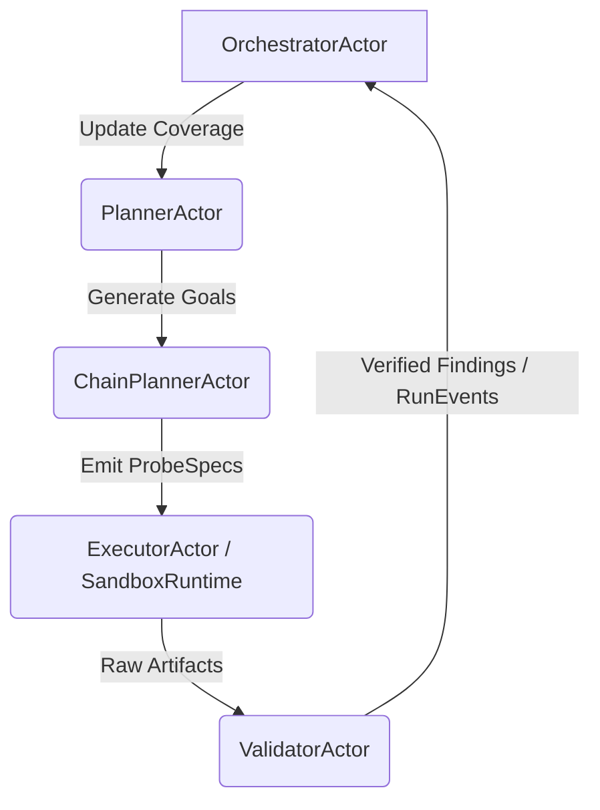

# NEORAPTOR Architecture

This document describes the complete system architecture, core domain model, and implementation details for NEORAPTOR — an autonomous offensive-security platform built on event-sourced runs and typed tool orchestration.

For a project overview and quick-start guide, see [../README.md](../README.md).

---

## 1. System Architecture & Core Philosophy

At minimum, each run must:

- **Find**: Autonomously discover exploitable weaknesses, enumerate attack surfaces, and synthesize multi-step attack paths instead of isolated CVEs.
- **Fix**: Generate actionable remediation guidance and tasks that map directly to discovered weaknesses and their root causes.
- **Verify**: Re-run targeted checks and structured probes to confirm that proposed fixes actually close the exploit paths.
- **Visibility**: Expose real-time run progress, current test state, active chains, and planner intent to the operator.
- **Prioritization**: Rank issues by impact on the environment and exploitability, not merely by vulnerability count or static severity labels.

Verification is a first-class citizen. NEORAPTOR does not just find a CVE; it chains logic, proves exploitability, and explicitly models the post-remediation retest to close the continuous threat exposure management (CTEM) loop.

Beyond this baseline, NEORAPTOR focuses on rigor, replayability, and explainability. It must:

- Make every meaningful step **event-sourced and replayable**, so runs can be resumed, audited, and re-simulated deterministically.
- Separate **planning, execution, parsing, validation, and chain synthesis** into independent actors with typed contracts.
- Use **typed tool families** instead of a flat tool list, preserving domain semantics such as session behavior, auth modes, and evidence formats.
- Maintain an **evidence graph** of typed findings, artifacts, and chain hypotheses, instead of relying on ad hoc logs.
- Treat **recovery and resumability** as first-class: crash-safe, idempotent, and restartable from the last durable event.
- Provide **operator-visible reasoning** for "why this tool," "why this path," "why this fix," and "why verification passed or failed."

The result is an offensive-security operating system, not "a scanner with AI."

NEORAPTOR is designed as a strict operating system with isolated domains, not a monolithic script or a raw LLM prompt. Its architecture is intended to reduce AI unpredictability while preserving adversarial intuition.

- **Event-Sourced Runs (Replayability):** State is not stored as a mutable snapshot. Every AI inference, packet sent, tool executed, and boundary evaluation is appended to an immutable cryptographic log. This supports exact replay for operators and strong forensic audit trails for incident response and compliance workflows.
- **The Evidence Graph:** NEORAPTOR models engagements as a directed acyclic graph (DAG) of goals, probes, findings, exploit chains, and remediation validations. Findings are explicitly linked to the exact payload and terminal output that generated them.
- **ScopeContract (Deterministic Governance):** The primary control against AI unpredictability. The ScopeContract is a programmatic, cryptographically signed rules-of-engagement definition. Before the OS allows an actor to pivot or execute an exploit, the action is evaluated against the ScopeContract as a runtime policy gate in the trusted control plane, not as a kernel primitive.

---

## System Context

NEORAPTOR sits between operators, infrastructure, and external offensive tooling as a control plane that drives a sandboxed execution plane.

At a high level:

- **Inputs**:
  - Operator intents (e.g., "assess external perimeter of tenant X within scope Y").
  - Scope contracts and governance policies that constrain where and how NEORAPTOR may operate.
  - Configuration for environments, providers, rate limits, and allowed tool families.
- **Outputs**:
  - Typed findings, attack paths, and evidence artifacts.
  - Remediation tasks and "fix plans" tied to specific evidence.
  - Verification results, including re-test traces and status.
  - Operator-facing reports and UI projections based on the evidence graph.
- **External Systems**:
  - LLM providers (for planning, validation, and summarization).
  - Sandboxed execution environments (e.g., containers, isolated workers).
  - Observability backends (logs, traces, metrics).
  - Datastores for events, artifacts, and configuration.

The system is designed as a long-running control plane that coordinates many short-lived, sandboxed tool executions.

### NEORAPTOR vs. Alternatives

| Dimension | Playbook Engines | Black-Box LLM Agents | **NEORAPTOR** |
|---|---|---|---|
| State model | Mutable config/YAML | Transient context window | Append-only event log (replayable) |
| Scope enforcement | Manual rules | Prompt conventions | Runtime-enforced `ScopeContract` in the trusted control plane |
| Reasoning transparency | Script steps | Opaque | Typed actor graph with full audit trail |
| Output guarantees | Fixed playbook | Stochastic | Typed `ProbeSpec` → `EvidenceArtifact` chain |
| Loop prevention | None | None | `CoverageMap` + `GapfillPolicy` |
| Exploit chaining | Manual | Hallucination-prone | `ChainPlannerActor` on durable `ConfirmedFinding` records |

> Scope enforcement is only as strong as the trusted computing base that evaluates it. The threat model must explicitly describe what happens if the control plane, sandbox runtime, or a dependency is compromised.

### Beyond the Minimum Baseline

Compared to playbook engines, NEORAPTOR adds:

- **Coverage-aware replanning** using `CoverageMap` and `GapfillPolicy`, not just static playbooks.
- **Explicit chain hypotheses** via `ChainPlannerActor` instead of opaque scoring of exposures.
- **Validator/mentor separation**, providing an adversarial review stage distinct from planners.
- Stronger **root-cause grouping** driven by the evidence graph.
- **Fix verification** tightly coupled to specific evidence, probes, and scopes.

Compared to black-box agentic systems, NEORAPTOR drives decisions by explicit, inspectable **"why this next"** reasoning exposed via observability and the UI, and avoids dead ends by replanning from the durable evidence graph rather than losing state.

The result is an offensive-security operating system with the autonomy of agents but the rigor of a well-engineered distributed system.

---

## 2. Crate Architecture: Control Plane vs Execution Plane

To improve safety and reduce sandbox escape risk, NEORAPTOR strictly segregates its **Brain** (Control Plane) from its **Hands** (Execution Plane). Decisions never share a process boundary with actions: the only path from high-level plans to real-world effects is through the `SandboxRuntime` port, which is the sole allowed crossing point between planes.

```text
neoraptor-workspace/
├── neoraptor-kernel/                 [Control Plane / "Brain"]
│   ├── agents-core          (Core primitives: RunEvent, ScopeContract, Evidence)
│   ├── neoraptor-planner    (Typed Autonomy Loop: Planners, Validators)
│   ├── neoraptor-governance (ScopeContract evaluation engine)
│   ├── neoraptor-evidence   (Event log and graph persistence)
│   └── neoraptor-supervisor (Actor supervision and escalation)
│
└── neoraptor-userland/               [Execution Plane / "Hands"]
    ├── neoraptor-sandbox    (Docker/gVisor runtime isolation boundaries)
    ├── neoraptor-tools      (Typed tool wrappers: nmap, sqlmap, custom exploits)
    └── neoraptor-worker     (Stateless execution nodes listening for ProbeSpecs)
```

For **v0.1.0**, crates that exhibit tight 1:1 coupling may be temporarily merged into fewer domain-centric crates (for example, collapsing `agents-core` and `agents-impl`, or `neoraptor-sandbox` and `neoraptor-tools` behind a single `neoraptor-execution` crate), with the explicit intent to re-extract them once operational boundaries are validated by usage and profiling.

### Plane Ownership

| Responsibility | Control Plane | Execution Plane |
|---|---|---|
| Owns | Goals, scopes, plans, chain hypotheses, validation, coverage-aware replanning, event log, evidence graph | Concrete tool execution in isolated sandboxes |
| Receives | Operator intents and scope contracts | Typed `ProbeSpec` describing what to run, with what parameters, and under which scope |
| Returns | Plans, findings, reports | Structured raw outputs and metadata only — no direct side-effects on the control plane |
| Governance | Enforces every action against the active `ScopeContract` | Cannot alter engagement state or bypass scope validation by design |
| Deployment | `api`, `agents`, `memory`/`db`, `observability` containers — highly trusted environment | Sandboxed tool workers, specialized heavy-task workers (crawling, fuzzing, packet capture) — ephemeral and stateless |

No tool runs directly from model text, and no execution bypasses typed parsing.

### Cargo Dependency Graph

```text
config ──► ports ◄─── memory
                  ├──► agents-core
                  └──► tools

providers ──(implements)──► ports
db ───────────────────────► ports (persistence repository traits)

agents-impl ──► agents-core
            ├──► memory
            └──► ports
                  ▲
                  │
            supervisor ──► agents-impl (imports actor constructors)

api ────────► agents-impl
          ├──► memory
          ├──► providers
          └──► supervisor
```

> **Rule:** Only `api/` and executable entrypoints may import `providers/`. All other crates depend on `ports/` traits only. Dependencies flow unidirectionally from the execution plane back to the domain model — never the reverse.

**Crate Consolidation Criteria (pre-v0.1.0):** The architecture defines many fine-grained crates for clear boundaries. However, premature splitting can slow delivery before boundaries are validated. Use these heuristics to decide when to temporarily merge crates:

1. **Co-change rate > 80%**: If two crates change together in >80% of PRs pre-v0.1.0, they are tightly coupled and should be merged into a single domain-centric crate (e.g., `neoraptor-control` or `neoraptor-execution`)
2. **Circular dependency pressure**: If maintaining the split requires awkward trait indirection or repeated refactoring, merge temporarily
3. **No clear integration test boundary**: If you cannot write an integration test that exercises one crate independently of the other, they belong together

**Re-extraction criteria:** Once v0.1.0 demonstrates stable operational boundaries (e.g., profiling shows `agents-core` is recompiled independently of `agents-impl` in 80% of changes), re-split the crates. Document the decision in an ADR (e.g., ADR-006: Crate Split Timeline) so the consolidation is recognized as temporary, not permanent architecture drift.


> Supervision should live outside `api/` business wiring. `api/` is the composition root and startup boundary; restart policy, panic handling, and escalation logic belong in a dedicated supervisor crate or core supervision module.

> ADR-002 records the sandbox network topology (`control-net`, `execution-net`, `observability-net`).

### Infrastructure and Deployment

NEORAPTOR deploys as a containerized, cloud-native control plane with flexible execution backends:

- **Single-node** for development and small environments.
- **Multi-service clusters** where control-plane components scale independently of sandboxed tool workers.
- **Kubernetes or equivalent** for scheduling, scaling, and isolation of execution-plane containers.

Adding more workers increases capacity without changing control-plane semantics.

---

## 3. Core Domain Model

NEORAPTOR operates on five fundamental OS-level primitives, located in `agents-core/` and `memory/`.

### `RunEvent`

The atomic unit of state. Implementations include `TargetDiscovered`, `ProbeDispatched`, `FindingConfirmed`, `ChainSynthesized`, `ProbeFailed`, `EscalationTransitioned`, and `ActorPanicked`. Every event carries a `ScopeContract.authorization_id` linking it to the originating operator authorization record. Events are stored in an append-only, cursor-resumable event store; SSE streams subscribe to persisted events, not actor mailboxes. Together, all events and artifacts form a replayable evidence graph that powers reporting, attack-path diagrams, remediation verification, and retrospective audit.

```text
Flow → Task → SubTask → Action → (EvidenceArtifact, MemoryEntry)
                                  ↓
                          EventLog (append-only, replayable)
```

**RunEvent Schema Versioning (ADR-005):** The append-only event log requires a concrete migration path to preserve replayability across releases. Before v0.1.0, the following pattern **must** be implemented:

1. **Database schema:** Add a `schema_version: u32` column to the `event_log` table (default `1`).
2. **Rust type:** Use a tagged enum envelope for event persistence:
   ```rust
   #[derive(Serialize, Deserialize)]
   #[serde(tag = "version")]
   pub enum VersionedRunEvent {
       #[serde(rename = "1")]
       V1(RunEventV1),
       // Future versions added here
   }
   ```
3. **Migration chain:** Register `MigrationFn = fn(&RawEvent) -> Result<RunEvent, MigrationError>` at startup in `event_store.rs`. The replay engine calls the migration chain to up-cast old records to the current version before processing.
4. **Enforcement:** A new `RunEvent` variant added post-v0.1.0 **must** increment the version number and add a migration function, or replay will fail on old logs. This is validated via integration tests that replay events from fixture files across version boundaries.

This pattern prevents the append-only log from becoming permanently unreadable after schema changes.

### `ScopeContract` — Typed Governance Layer

The cryptographic safety boundary for authorized actions. Captures allowed targets, domains, IP ranges, protocols, time windows, tool families, execution intensity, and disallowed operations. Evaluated dynamically on **every** state transition in trusted control-plane code; if a proposed action violates the contract, the system fails closed at the planning stage. Not `Clone`. Constructed only via `ScopeContractBuilder` at startup — missing `allowed_targets` is a hard startup failure.

`ScopeContract` is **effectively immutable** post-construction. All callers in the typestate pipeline receive `&ScopeContract`, and actors that need concurrent read access hold a single `Arc<ScopeContract>` — never per-field `Arc<[T]>` clones — to avoid atomic refcount contention on the hot probe-dispatch path. No `RwLock` is needed since the contract never mutates. If future requirements demand scope amendment mid-run (e.g., time-window extension), model it as an immutable snapshot swap: `Arc::new(new_contract)` stored in an `ArcSwap` from the `arc-swap` crate, preserving lock-free reads. At the workspace level, `clippy::clone_on_ref_ptr` is enabled as a deny-by-default lint (with narrow, documented exceptions) to enforce that `Arc`-backed structures in hot paths are borrowed rather than cloned.

**Arc clone policy for hot-path actors:** For latency-sensitive actors (`ExecutorActor`, `OrchestratorActor`, `ValidatorActor`), explicitly document which `Arc<T>` types are **allowed** to be cloned at actor boundaries:
```rust
// agents-core/src/shared.rs

/// Intentionally Clone: safe to clone at actor spawn boundaries
#[derive(Clone)]
pub struct SharedScope(Arc<ScopeContract>);

impl SharedScope {
    pub fn new(contract: ScopeContract) -> Self {
        Self(Arc::new(contract))
    }
    
    pub fn get(&self) -> &ScopeContract {
        &self.0
    }
}

// Similarly for RawOutput:
#[derive(Clone)]
pub struct SharedOutput(Arc<[u8]>);
```
Use these newtypes at actor boundaries; the rest of the codebase uses `&ScopeContract` and `&[u8]` refs. This makes intentional clones explicit in benchmarks and prevents accidental `Arc::clone` in hot loops.

```rust
// agents-core/src/scope.rs

pub struct ScopeContract {
    pub allowed_targets: Arc<[Target]>,      // non-empty, startup-validated
    pub excluded_paths: Arc<[ExcludedPath]>,
    pub requires_approval_above: RiskLevel,
    pub valid_until: DateTime<Utc>,          // time-bounded authorization
    pub authorization_id: Uuid,              // every action traces to an authorization event
}
// ScopeContract is NOT Clone.
// Pass &ScopeContract through the entire typestate pipeline.
// For shared actor access use Arc<ScopeContract> (no RwLock — it's immutable).
// For mid-run amendments (future): use arc_swap::ArcSwap<ScopeContract> for lock-free updates.
```

The full typestate pipeline — skipping any step is a **compile-time error**:

```text
RawGoal → ScopeContract::authorize() → Intent → ValidatedIntent → ExecutionPlan → ValidatedCommand → SandboxRuntime
```

### `ProbeSpec` — Typed Vulnerability Specification Layer

A typed request to execute a specific tool (e.g., `PortScanProbe`, `SqlInjectionProbe`), encoding the vulnerability class, target, preconditions, tool family, and expected evidence. Avoids brittle raw shell generation and allows planners and validators to reason about probes before they run and after they return, supporting "why this probe" traceability and audit replay.

`P` is a phantom type encoding the probe's protocol class. The fingerprint version is encoded in a second const generic parameter `const V: u32` so that cross-version deduplication is a **compile-time type mismatch** rather than a runtime logic error — `ProbeDeduplicator` is `impl<P, const V: u32> Dedup for ProbeSpec<P, V>` and cannot accidentally merge specs from different fingerprint schema versions. `ProbeDeduplicator` merges identical fingerprints; the fingerprint schema is versioned to avoid silent over- or under-deduplication across releases. Validated specs are stored as typed records via `ProbeSpecRepository`.

**Monomorphization mitigation:** Each unique `(P, V)` combination generates a full monomorphized copy of every generic function. To avoid codegen bloat as probe protocols and schema versions accumulate:
1. Introduce a `ProbeSpecData` struct carrying all heap-allocated fields (steps, preconditions, indicators, etc.)
2. Keep `ProbeSpec<P, V>` as a thin typed wrapper: `struct ProbeSpec<P, V> { data: ProbeSpecData, _protocol: PhantomData<P>, _version: PhantomData<V> }`
3. Push non-generic logic (serialization, validation, comparison) into methods on `ProbeSpecData` — monomorphization only occurs at the dispatch callsite where protocol type matters
4. Use trait-object helpers (`&dyn ProbeProtocol`) for cross-protocol shared logic

This pattern keeps the typed guarantees (compile-time version mismatch errors) while bounding binary size growth.

```rust
// agents-core/src/probe.rs

pub struct ProbeSpec<P: ProbeProtocol, const FINGERPRINT_V: u32> {
    pub id: ProbeId,
    pub target_class: TargetClass,
    pub risk_level: RiskLevel,
    pub preconditions: Vec<Precondition>,
    pub steps: Vec<ProbeStep>,
    pub expected_indicators: Vec<Indicator>,
    pub requires_poc: bool,
    _protocol: PhantomData<P>,
}

// Cross-version deduplication is a type error:
// ProbeDeduplicator cannot merge ProbeSpec<P, 1> with ProbeSpec<P, 2>.
impl<P: ProbeProtocol, const V: u32> Dedup for ProbeSpec<P, V> { ... }
```

**Crate placement:** `agents-core/` (ProbeSpec, ProbeDeduplicator, ProbeProtocol, RiskLevel, Indicator, Precondition), `db/` (ProbeSpecRepository), `agents-impl/DeveloperActor` (ProbeSpecDraft authoring).

### `EvidenceArtifact`

A durable reference to the exact HTTP response, packet dump, or terminal output that justifies a finding. Each artifact is linked to the run and event that created it, the tool family and `ProbeSpec` involved, and the scope and targets touched — forming the proof layer behind every finding and chain hypothesis.

`RawOutput` is defined as `Arc<[u8]>` (or `bytes::Bytes` for zero-copy slicing). This is the **required** concrete type — contributors must not substitute `Vec<u8>`, which causes a full heap copy per pipeline stage (parse → validate → artifact store). The `#[deny(clippy::clone_on_ref_ptr)]` lint is suppressed only at explicitly reviewed call sites. To prevent control-plane OOM, sandbox stdout/stderr must be read as bounded chunks with a hard `ExecutionLimits.max_output_bytes` cap enforced at the `SandboxRuntime` boundary. When output is truncated at this limit, the truncation is recorded alongside the artifact so downstream parsers and validators cannot treat partial data as complete.

**Streaming API contract:** To prevent accidental `Vec<u8>` allocation or missed truncation handling, `SandboxRuntime` **must** expose a streaming API, and `EvidenceArtifact` **must** provide a single safe constructor that consumes this stream:
```rust
// neoraptor-sandbox/src/runtime.rs
impl SandboxRuntime {
    pub async fn stream_output(&self, task_id: TaskId) 
        -> impl Stream<Item = Result<Bytes, SandboxError>> {
        // Returns chunks as they arrive from Docker stdout/stderr
    }
}

// agents-core/src/artifact.rs
impl EvidenceArtifact {
    /// The ONLY way to construct an EvidenceArtifact.
    /// Accumulates stream into Arc<[u8]> up to max_output_bytes,
    /// sets OutputTruncation::Truncated if limit exceeded.
    pub async fn from_stream<S>(
        stream: S,
        max_bytes: usize,
        metadata: ArtifactMetadata,
    ) -> Result<Self, ArtifactError>
    where
        S: Stream<Item = Result<Bytes, SandboxError>>,
    {
        let mut buffer = Vec::with_capacity(std::cmp::min(max_bytes, 64 * 1024));
        let mut total = 0;
        let mut truncation = OutputTruncation::NotTruncated;
        
        pin_mut!(stream);
        while let Some(chunk) = stream.next().await {
            let chunk = chunk?;
            if total + chunk.len() > max_bytes {
                // Truncate and stop consuming
                let remaining = max_bytes - total;
                buffer.extend_from_slice(&chunk[..remaining]);
                truncation = OutputTruncation::Truncated { truncated_at: max_bytes };
                break;
            }
            buffer.extend_from_slice(&chunk);
            total += chunk.len();
        }
        
        Ok(EvidenceArtifact {
            output: Arc::from(buffer),
            truncation,
            metadata,
        })
    }
    
    // No pub fn new(..., output: RawOutput, ...) — force streaming path
}
```
This design ensures downstream code **cannot** bypass truncation enforcement or allocate unbounded `Vec<u8>` — the only constructor is `from_stream`, which enforces the limit.

```rust
// domain/src/artifact.rs

/// Raw sandbox output. Always `Arc<[u8]>` — never clone into Vec<u8>.
/// Zero-copy slicing: use `bytes::Bytes::copy_from_slice` when sub-slicing is needed.
pub type RawOutput = Arc<[u8]>;

/// Indicates whether sandbox output was truncated by ExecutionLimits.
pub enum OutputTruncation {
    NotTruncated,
    Truncated { truncated_at: usize },
}

pub struct EvidenceArtifact {
    pub output: RawOutput,
    pub truncation: OutputTruncation,
    // ... run id, probe id, scope, version, etc. ...
}
```

> ADR-003 records the artifact storage strategy and the semantics of `OutputTruncation` for downstream components.

### `CoverageMap`

A spatial and logical map of the target environment. Tracks which `(TargetComponent, AttackClass)` pairs have been explicitly tested and their outcomes. Persisted in the event log and cursor-resumable. The companion `GapfillPolicy` defines how the planner reacts to coverage gaps and diminishing returns, reallocating effort from over-explored areas to under-tested segments of the scope — together driving coverage-aware replanning.

```text
CoverageMap tracks per (TargetComponent, AttackClass) pair:
  - ConfirmedFinding
  - DisputedFinding
  - NoFinding
  - Touched but not covered thoroughly (flagged by ExecutorActor)
```

**Crate placement:** `agents-core/` (GapfillPolicy contract), `memory/` (canonical durable CoverageMap state), `agents-impl/OrchestratorActor` (coverage-aware replanning).

---

## 4. Crate Dependency Graph

```text
config ──► ports ◄─── memory
                  ├──► agents-core
                  └──► tools

providers ──(implements)──► ports
db ───────────────────────► ports (persistence repository traits)

agents-impl ──► agents-core
            ├──► memory
            └──► ports
                  ▲
                  │
            supervisor ──► agents-impl (imports actor constructors)

api ────────► agents-impl
          ├──► memory
          ├──► providers
          └──► supervisor
```

Dependencies always flow **from execution back toward the domain model** — `tools/` and `agents-impl/` depend on `ports/` traits, never on `providers/` directly. `api/` is the sole composition root where concrete providers are wired into abstract traits.

- `ports/` is intentionally small and stable; it does **not** depend on `config/`. Capability traits in `ports/` expose pure behavior; all configuration structs and knobs live in `config/` and are injected at wiring time in `api/` when constructing concrete `providers/`.
- `memory/` depends on `SummarizationStrategy` from `ports/` — never directly on `LlmProvider`.
- `db/` depends on repository interface traits in `ports/`, never on `memory/` domain types directly.
- For v0.1.0, boundaries should be proven by usage. If the current crate split slows delivery before validating the architecture, crates with tight coupling may be collapsed and later re-extracted once operational boundaries are demonstrated.

Cross-cutting error types (I/O, sandbox, policy) are shared via a central `error-core` module that uses `thiserror` plus `From` conversions, keeping `anyhow` usage confined to the `api/` composition and HTTP boundary layer.

---

## 5. Typed Autonomy Loop

Unlike basic agentic loops that rely on very large unconstrained context windows, NEORAPTOR uses an actor-based, multi-stage, typed autonomy loop.



### Run Lifecycle

A run flows through typed stages:

1. **Goal Intake**. The operator submits a goal via the SvelteKit UI.
2. **Scope Authorization**. A `ScopeContract` is validated and attached to the run; all subsequent actions must remain inside this contract.
3. **Plan**. `OrchestratorActor` decomposes the goal into phases and tasks, persists them in `memory/`, and uses `CoverageMap` plus `GapfillPolicy` to assign work.
4. **Execute**. `ExecutorActor` converts `Intent` → `ScopeContract::authorize()` → `ValidatedIntent` → `ExecutionPlan` → `ValidatedCommand` and executes via sandbox, with `ProbeDeduplicator` merging identical fingerprints.
5. **Parse**. Tool outputs are stored as `Action` + `EvidenceArtifact`, appended to the event log, and fed into decision-making.
6. **Validate**. `ValidatorActor` performs adversarial review and emits `ConfirmedFinding` or `DisputedFinding`; it cannot emit new findings.
7. **Replan**. `ChainPlannerActor` consumes `ConfirmedFinding` records, synthesizes `ChainHypothesis` instances, and adjusts the plan based on coverage gaps and new opportunities.
8. **Remediate**. The system generates remediation tasks and fix guidance, grouped by root cause and supported by evidence.
9. **Re-test**. Targeted verification probes confirm remediation closes the exploit paths.
10. **Report & Explain**. The evidence graph is projected into reports, timelines, and attack-path diagrams, with "why this next" explanations in the UI and observability layer.

At every step, the control plane emits durable events and artifacts, enabling full replay, partial re-execution, and fine-grained operator inspection.

### Actor Roles

- **`PlannerActor` (The Strategist):** Analyzes the `CoverageMap` and current evidence graph, then decides high-level goals.
- **`ChainPlannerActor` (The Tactician):** Synthesizes `ProbeSpec` commands bounded by the `ScopeContract`, consuming durable `ConfirmedFinding` records.
- **`ExecutorActor`:** Marshals the `ProbeSpec` across the runtime boundary into the sandbox.
- **`ValidatorActor` (The Skeptic):** Parses executor output, uses a different LLM provider for adversarial independence, and reasons from the `FindingId` plus `ProbeSpec` only. The validator runs as a **separate bounded work-stealing pool** with its own `ProbeSpec` queue depth metric (`validator_queue_depth`, `validator_p99_latency`). Under sustained load the `ValidatorThrottle` sheds excess work by promoting items to `DisputedFinding` for human review rather than blocking `ExecutorActor`.

```rust
// agents-core/src/validator.rs

pub enum ValidatorMessage {
    Confirm { finding_id: FindingId },
    Dispute { finding_id: FindingId, reason: String },
}
// ValidatorMessage uses stable IDs only. Canonical finding records live in memory/.
```

- **`OrchestratorActor`:** Owns flow lifecycle and policy enforcement; the wrong outbound `ValidatorMessage` type is a compile-time error.
- **`MentorActor`:** Runs `LoopDetectionPolicy` on a fixed-size ring buffer, not an unbounded sliding window. The ring buffer size and detection sensitivity are governed by `LoopDetectionConfig`:

```rust
// agents-core/src/mentor.rs

/// Tune via config; defaults are startup-validated (window_size must be NonZero).
pub struct LoopDetectionConfig {
    /// Number of recent probe fingerprints to retain. Larger values catch slow cycles
    /// at the cost of higher detection latency for tight loops. Recommended: 64–256.
    pub window_size: NonZeroUsize,
    /// Cosine-similarity threshold above which two fingerprints are considered identical.
    pub similarity_threshold: f32,
    /// Minimum occurrences within the window before a loop is declared.
    pub min_occurrences: u8,
}
// Required metrics: mentor_loop_detections_total, mentor_false_positive_overrides_total.
// Export both as Prometheus counters so window_size can be tuned operationally.
```

`LoopDetectionConfig` is constructed via a `try_new` constructor that validates all bounds and invariants, rather than allowing arbitrary struct literals, ensuring that misconfigurations are surfaced early and consistently.

- **`RootSupervisor`:** Owns actor lifecycle, panic recovery, escalation, and coordinated shutdown outside the `api/` crate.

### Backpressure

Backpressure is mandatory between `OrchestratorActor`, `ExecutorActor`, and `SandboxRuntime`. Use bounded `tokio::sync::mpsc` channels so queue growth is explicit and observable. `ProbeSpec` queue depth, dropped work, and planner stall time should be exported as metrics.

**Validator backpressure:** If `ValidatorActor` cannot keep up with incoming findings, excess items are promoted to `DisputedFinding` for human review as a last-resort shedding strategy. However, shed items are **never automatically retried** — they accumulate in "awaiting human review" indefinitely. Under sustained overload, this queue grows unboundedly and silently lowers coverage. To prevent this:
1. Export `validator_shed_total` (counter) and `validator_human_queue_depth` (gauge) metrics
2. Wire a high-watermark threshold: when `validator_human_queue_depth` exceeds the threshold, `OrchestratorActor` reduces `ExecutorActor` concurrency **before shedding occurs**
3. Treat shedding as a last resort, not the primary backpressure mechanism — the validator queue should apply backpressure upstream to slow execution, not discard work

This ensures coverage degradation is visible in metrics and bounded, rather than silent and unbounded.

**Hard cap on human-review queue (CRITICAL):** To prevent unbounded growth, `DisputedFindingRepository` must enforce a hard per-run cap on pending human-review items:
```rust
// memory/src/disputed.rs
impl DisputedFindingRepository {
    pub async fn insert(&self, finding: DisputedFinding, run_id: RunId) 
        -> Result<(), RepositoryError> {
        let current_count = self.count_pending(run_id).await?;
        if current_count >= self.config.max_human_review_per_run {
            // Fail closed: reject the insert and emit coverage degradation event
            self.event_store.append(RunEvent::CoverageDegraded {
                run_id,
                reason: format!("Human-review queue at capacity: {}", current_count),
                timestamp: Utc::now(),
            }).await?;
            return Err(RepositoryError::HumanReviewQueueFull);
        }
        // ... proceed with insert
    }
}
```
When `RunEvent::CoverageDegraded` is emitted, `OrchestratorActor` **must stop accepting new work** until the queue drains below the watermark. This fail-closed behavior prevents silent coverage loss and makes capacity issues immediately visible to operators.

To make backpressure guarantees harder to accidentally bypass, actors use typed wrappers such as `BoundedQueue<T>` around the underlying `mpsc::Sender`, so queue capacity and semantics are encoded in the type system and not reconfigured ad hoc.

**BoundedQueue design:** Initially documented as `BoundedQueue<ValidatorMessage, N>` with a const generic capacity `N`, but this contradicts runtime-configurable capacities from `ChannelCapacities` config. The correct design:
```rust
// agents-core/src/bounded.rs
pub struct BoundedQueue<T> {
    sender: mpsc::Sender<T>,
    capacity: usize,
}

impl<T> BoundedQueue<T> {
    pub fn new(capacity: usize) -> (Self, mpsc::Receiver<T>) {
        let (tx, rx) = mpsc::channel(capacity);
        (BoundedQueue { sender: tx, capacity }, rx)
    }
    
    pub fn capacity(&self) -> usize { self.capacity }
}
```
The compile-time guarantee is already provided by `mpsc::channel(n)` — the newtype just documents intent and prevents accidental unbounded replacement. No const generic needed.

**ChannelCapacities validation contract:** To prevent misconfiguration that creates effectively unbounded or mis-sized queues, enforce strict bounds:
```rust
// agents-core/src/limits.rs
use std::num::NonZeroUsize;

#[derive(Debug, Clone)]
pub struct ChannelCapacities {
    pub planner_to_executor: NonZeroUsize,
    pub executor_to_validator: NonZeroUsize,
    pub validator_to_orchestrator: NonZeroUsize,
}

impl ChannelCapacities {
    const MAX_CAPACITY: usize = 10_000;
    
    pub fn try_from_config(config: &ExecutionLimits) -> Result<Self, ConfigError> {
        let validate = |name: &str, value: usize| -> Result<NonZeroUsize, ConfigError> {
            if value == 0 {
                return Err(ConfigError::InvalidCapacity { 
                    channel: name.to_string(), 
                    reason: "capacity must be > 0" 
                });
            }
            if value > Self::MAX_CAPACITY {
                return Err(ConfigError::InvalidCapacity {
                    channel: name.to_string(),
                    reason: format!("capacity {} exceeds max {}", value, Self::MAX_CAPACITY),
                });
            }
            Ok(NonZeroUsize::new(value).unwrap()) // safe: checked > 0 above
        };
        
        Ok(ChannelCapacities {
            planner_to_executor: validate("planner_to_executor", config.planner_queue)?,
            executor_to_validator: validate("executor_to_validator", config.validator_queue)?,
            validator_to_orchestrator: validate("validator_to_orchestrator", config.orchestrator_queue)?,
        })
    }
}
```

**Backpressure integration tests:** Add tests that verify channels exert backpressure under load:
```rust
#[tokio::test]
async fn test_executor_queue_backpressure() {
    let capacities = ChannelCapacities {
        executor_to_validator: NonZeroUsize::new(10).unwrap(),
        // ... other capacities
    };
    
    let (queue, mut rx) = BoundedQueue::new(capacities.executor_to_validator.get());
    
    // Fill the queue
    for i in 0..10 {
        queue.sender.send(ValidatorMessage::Finding(i)).await.unwrap();
    }
    
    // Next send should block (or return Full in try_send)
    let result = queue.sender.try_send(ValidatorMessage::Finding(99));
    assert!(result.is_err()); // Queue full
    
    // Drain one item and verify send succeeds
    let _ = rx.recv().await;
    assert!(queue.sender.try_send(ValidatorMessage::Finding(100)).is_ok());
}
```

This ensures backpressure behavior is tested, not just documented.

### Supervision and Shutdown

Every long-lived actor is registered in an `ActorRegistry` that owns `JoinHandle<Result<(), ActorError>>` per actor. `ActorRegistry` is the **sole owner** of every handle; its `Drop` implementation aborts all handles to prevent silent task detachment. The `CancellationToken` for each actor is stored alongside its `JoinHandle` so cancellation and join are always co-located.

```rust
// neoraptor-supervisor/src/registry.rs

pub struct ActorRegistry {
    actors: HashMap<ActorId, ActorEntry>,
}

struct ActorEntry {
    handle: JoinHandle<Result<(), ActorError>>,
    cancel: CancellationToken,
}

impl ActorRegistry {
    /// Initiate a graceful shutdown: signal cancellation, wait up to `timeout`
    /// for actors to complete, then abort any remaining tasks.
    pub async fn graceful_shutdown(&mut self, timeout: Duration) {
        for entry in self.actors.values() {
            entry.cancel.cancel();
        }

        let deadline = tokio::time::Instant::now() + timeout;
        for entry in self.actors.values_mut() {
            let remaining = deadline.saturating_duration_since(tokio::time::Instant::now());
            if remaining.is_zero() {
                entry.handle.abort();
                continue;
            }
            let handle = &mut entry.handle;
            let _ = tokio::time::timeout(remaining, handle).await;
        }
    }
}

impl Drop for ActorRegistry {
    fn drop(&mut self) {
        // In production, graceful_shutdown() should be called explicitly.
        // Drop acts as a last-resort safety net.
        for entry in self.actors.values() {
            entry.cancel.cancel();
            entry.handle.abort();
        }
    }
}
```

**Dependency Direction:** `ActorRegistry::spawn_all()` lives in `neoraptor-supervisor`; `agents-impl` exports actor constructors (e.g., `fn spawn_orchestrator(...) -> JoinHandle<...>`). The supervisor imports `agents-impl` to instantiate actors, **never the reverse**. This preserves the kernel/userland boundary: agents are unaware of the supervision layer.

**Infrastructure Thread Tracking:** The panic hook writes via `std::sync::mpsc` to a dedicated sync thread that persists `RunEvent::ActorPanicked` records. This sync thread's `JoinHandle` **must not** be stored in `ActorRegistry` — if the sync thread panics or blocks, the panic events it's supposed to catch would be silently dropped. Instead, track it in a separate `InfraHandles` struct owned by `RootSupervisor`, outside the async actor lifecycle, so it is joined **last** during shutdown, after all actors have exited. This ensures the panic-log sink outlives all panic sources.

```rust
// neoraptor-supervisor/src/infra.rs
pub struct InfraHandles {
    panic_log_thread: Option<std::thread::JoinHandle<()>>,
}

impl InfraHandles {
    pub fn shutdown(mut self, timeout: Duration) {
        if let Some(handle) = self.panic_log_thread.take() {
            let _ = handle.join();  // Join after all actors stopped
        }
    }
}
```

`JoinHandle` must be retained deliberately because dropping it detaches the task. Actor panics are detected **at the `JoinHandle` boundary** — the supervisor loop `await`s each handle and matches `Err(JoinError)` to learn about panics. A single `PanicReporter` abstraction ensures that `RunEvent::ActorPanicked` is emitted at most once per `(RunId, ActorId)` pair, regardless of whether the panic is observed first via the global panic hook or via the supervisor's `JoinHandle` watchdog.

Escalation is a persisted typestate state machine with explicit guarded transitions: `Retrying → Quarantined → AwaitingManualApproval → Aborted`. The typestate encoding prevents illegal transitions at compile time:

```rust
// neoraptor-supervisor/src/escalation.rs

pub struct EscalationState<S> { _state: PhantomData<S> }

pub struct Retrying;
pub struct Quarantined;
pub struct AwaitingManualApproval;
pub struct Aborted;

impl EscalationState<Retrying> {
    /// Transition is only callable from Retrying — illegal transitions are compile errors.
    pub fn quarantine(self, actor_id: ActorId, event_log: &dyn EventLog)
        -> EscalationState<Quarantined>
    {
        event_log.append(RunEvent::EscalationTransitioned {
            actor_id,
            to: EscalationStage::Quarantined,
        });
        EscalationState { _state: PhantomData }
    }
}

impl EscalationState<Quarantined> {
    pub fn request_approval(self, actor_id: ActorId, event_log: &dyn EventLog)
        -> EscalationState<AwaitingManualApproval>
    {
        // ...
    }
}

impl EscalationState<AwaitingManualApproval> {
    pub fn abort(self, actor_id: ActorId, event_log: &dyn EventLog)
        -> EscalationState<Aborted>
    {
        // ...
    }
}
```

Each transition is recorded as `RunEvent::EscalationTransitioned`. Tool families must also define a `RetryPolicy` with exponential backoff, max retry count, and a quarantine action that temporarily removes persistently failing tools from the planner's available set.

Install a global panic hook at startup so actor panics are logged structurally and routed as a telemetry signal. Rust's panic hook runs before unwinding begins, so it is the right place to record the failure path — but supervision decisions (retry, quarantine, abort) must be driven by `JoinHandle::await` results, not by the hook. Graceful shutdown must propagate a `CancellationToken` hierarchy from the supervisor through all actors and sandbox executions: `SIGTERM → stop intake → drain bounded queues → terminate sandboxes → force-kill after timeout`.

### Startup vs. Runtime Boundary

`unwrap()`, `expect()`, and `panic!()` are permitted only in startup validation code. To prevent scope creep on this exception, all startup validation is confined to a single `fn init() -> Result<System, StartupError>` entry point that returns before any actor is spawned. Code that runs after `init()` returns is runtime code and the ban applies unconditionally. A typestate marker enforces this structurally:

```rust
// api/src/startup.rs

pub struct StartupPhase;
pub struct RuntimePhase;

/// All .expect() / .unwrap() calls live here and nowhere else.
pub fn init(_: StartupPhase) -> Result<(System, RuntimePhase), StartupError> {
    // Step 1: Validate ToolCallPolicy first (must happen before ScopeContract)
    let validated_policy = ToolCallPolicyValidator::validate(load_policy()?)?;
    
    // Step 2: Build ScopeContract — requires ValidatedToolPolicy token
    let scope = ScopeContractBuilder::new()
        .allowed_targets(load_targets()?)
        .with_policy(validated_policy)  // Consumes the token
        .build()
        .expect("allowed_targets validated above; infallible");
    // ... remaining startup assertions ...
    Ok((System { scope, /* ... */ }, RuntimePhase))
}
```

**Startup ordering guarantee:** `ScopeContractBuilder::build()` consumes a `ValidatedToolPolicy` token, making it a **compile-time precondition** that the policy is validated before the contract is sealed. This prevents a misconfigured policy from allowing unauthorized tool families to be referenced in an already-signed contract. The failure surfaces at compile time (missing token) or early startup (validation error), never after the contract is active.

```

At the workspace level, `clippy::panic`, `clippy::unwrap_used`, and `clippy::expect_used` are set to `deny`, with targeted `#[allow]` annotations scoped to `startup.rs` and other initialization-only modules that explicitly operate under `StartupPhase`. After `init()` returns a `RuntimePhase` token, no downstream code can legally call `init()`-only APIs or rely on panicking for control flow.

---

## 6. Tools & SandboxRuntime

NEORAPTOR treats tools as structured, typed families rather than flat command-line wrappers. Tools never run directly from LLM text — the typestate pipeline enforces this at compile time.

To keep the documentation and trait-variant pattern uniform and less error-prone, macro invocations that define pentest tool traits are wrapped in small local macros that expand to both the documentation block and the `#[trait_variant::make]` attribute.

```rust
// neoraptor-tools/src/macros.rs

/// Helper macro to define a PentestTool trait pair with standard docs.
#[macro_export]
macro_rules! define_pentest_tool_trait {
    ($name:ident) => {
        /// # Trait Variants
        ///
        /// This declaration generates two traits via `#[trait_variant::make]`:
        ///
        /// - **`LocalPentestTool`** — the base trait. Implement this in non-`Send` contexts
        ///   (e.g., single-threaded tests or sync wrappers).
        /// - **`PentestTool`** — the `Send`-bounded variant generated by the macro.
        ///   Implement `PentestTool` (not `LocalPentestTool`) when the implementor will be
        ///   stored in `Arc<dyn PentestTool + Send + Sync>` and used across async actor boundaries.
        ///
        /// If you see "expected `PentestTool`, found `LocalPentestTool`" in a compiler error,
        /// you are implementing the wrong variant — switch to `impl PentestTool for YourType`.
        #[trait_variant::make($name: Send)]
        pub trait LocalPentestTool {
            fn name(&self) -> &str;
            async fn plan(&self, intent: &ValidatedIntent) -> Result<ExecutionPlan, PolicyError>;
            async fn execute(
                &self,
                plan: &ExecutionPlan,
                runtime: &dyn SandboxRuntime,
                cancel: CancellationToken,
            ) -> Result<RawOutput, SandboxError>;
            async fn parse_result(
                &self,
                output: RawOutput,
            ) -> Result<StructuredResult, SandboxError>;
        }
    };
}
```

Usage:

```rust
// neoraptor-tools/src/lib.rs

define_pentest_tool_trait!(PentestTool);
```

### Typed Tool Families

Tools are defined by traits (e.g., `ReconTool`, `ExploitTool`, `VerificationTool`). A `ProbeSpec` requests an outcome from a tool family, and the Execution Plane selects the optimal binary based on the environment. `ToolCallPolicy` is startup-validated; empty policies are rejected at startup.

### SandboxRuntime

All tools execute within isolated Docker or gVisor environments. The runtime regulates network ingress/egress based on the active `ScopeContract`, reducing the risk that a malformed plan executes against an out-of-scope target.

- **Default Docker hardening:** Rootless execution, seccomp profile, read-only filesystem, explicit network egress rules, CPU/memory/disk resource limits.
- **Opt-in Firecracker:** Firecracker microVMs when KVM is available. If configured but unavailable, startup fails unless `sandbox.firecracker_unavailable_fallback = "docker"` is set; this fallback is logged as `WARN`.
- Every invocation carries a `CancellationToken` tied to `ExecutionLimits.max_duration`.
- Sandbox stdout/stderr must be streamed with a hard `ExecutionLimits.max_output_bytes` cap instead of buffering unbounded output.
- Sandbox stdout/stderr, exit code, duration, profile, and resource usage are recorded as structured `EvidenceArtifact` records.

For any FFI or OS-level sandbox integration, the runtime encapsulates in-flight work in small `SandboxTask` structs that implement `Drop` to close descriptors and clean up state when tasks are cancelled or aborted, rather than relying solely on `JoinHandle::abort`.

### Rate Limiting

v1 standardizes on a single in-process rate limiter using the `governor` crate (GCRA algorithm). All tools inherit rate limiting automatically through the `RateLimitedSandboxRuntime` newtype in `neoraptor-tools` — per-caller ad hoc logic is forbidden. In async contexts, use `RateLimiter::until_ready_with_jitter()` with `Jitter::up_to(Duration::from_millis(50))` and `governor::clock::MonotonicClock` to prevent thundering-herd retries under burst probe load. Never `sleep_until(not_until.earliest_possible())` without jitter.

```rust
// neoraptor-tools/src/rate_limit.rs

pub struct RateLimitedSandboxRuntime<R> {
    inner: R,
    limiter: Arc<RateLimiter<NotKeyed, InMemoryState, MonotonicClock>>,
}

impl<R: SandboxRuntime> SandboxRuntime for RateLimitedSandboxRuntime<R> {
    async fn execute(
        &self,
        spec: &ValidatedCommand,
        cancel: CancellationToken,
    ) -> Result<RawOutput, SandboxError> {
        self.limiter
            .until_ready_with_jitter(Jitter::up_to(Duration::from_millis(50)))
            .await;
        self.inner.execute(spec, cancel).await
    }
}
```

Service-level resource limits and backpressure for **database pools** and **LLM providers** complement this tool-level rate limiting: actors wrap DB access and `LlmProvider` calls behind semaphores with configurable permits per service, and emit metrics for queue depth and wait time to guide tuning.

### Secret Management

Secrets are modeled as typed values, not ad hoc environment variables. The system stores secrets in dedicated secret stores or vault integrations via `ports` and `providers`, injects them into tool families or providers only at execution time and only when authorized by `ScopeContract` and configuration, and avoids rendering secrets into logs, traces, or artifacts except in carefully controlled debug flows. Secrets (API keys, target credentials) are wrapped in `secrecy::Secret<T>` at config boundaries.

Enforcement uses `clippy.toml` `disallowed-methods` rather than grep:

```toml
# clippy.toml
disallowed-methods = [
    { path = "secrecy::ExposeSecret::expose_secret", reason = "Only permitted in providers/ at reviewed call sites. Requires #[allow(clippy::disallowed_methods)] + reviewer comment." },
]
```

Every new `.expose_secret()` call is a CI failure unless the call site carries an explicit `#[allow(clippy::disallowed_methods)]` with a reviewer comment. This ensures that both offensive tooling and external APIs operate with least privilege.

---

## Appendix / Implementation Notes

*This section aggregates lower-level architectural decisions, implementation details, and workspace configurations.*

- **Error Handling:** Library crates expose typed errors with `thiserror`; `anyhow` is allowed only in `api/`. All executor failures are modeled as `RunEvent::ProbeFailed` rather than fatal panics, allowing the autonomy loop to recover and re-plan. `unwrap()`, `expect()`, and `panic!()` are banned in production crates except in startup validation (confined to `fn init()` — see §5 Startup vs. Runtime Boundary). **Invariant violations** must use named error variants (e.g., `ActorError::InvariantViolated { context: String }`) returned via `Result`, **not** `unreachable!() + debug_assert!()` — the latter compiles out `debug_assert!` in release builds, leaving `unreachable!()` unguarded and violating `clippy::panic = "deny"`.

**Invariant failure pattern for typestate:** For compile-time-guaranteed impossible branches (e.g., exhaustive typestate pattern matches), use this helper:
```rust
// error-core/src/invariant.rs
#[cold]
pub fn invariant_failed<T>(context: &'static str) -> Result<T, InvariantError> {
    Err(InvariantError::Violated { context })
}

// Usage in typestate code:
match escalation_state {
    EscalationState::Retrying(s) => s.transition_to_quarantined(),
    EscalationState::Quarantined(s) => s.transition_to_awaiting_approval(),
    // Typestate guarantees this branch is unreachable, but we don't panic:
    _ => invariant_failed("EscalationState in impossible variant")?,
}
```
The `#[cold]` attribute hints to the optimizer that this branch is never taken, while still providing a non-panic failure path. A shared `error-core` module hosts reusable error enums for cross-cutting concerns.
- **Retry & Circuit Breaking:** Every tool family defines `RetryPolicy { max_retries, backoff, quarantine_after }`. Repeated failures trip a circuit breaker, emit `RunEvent::EscalationTransitioned`, and remove the tool temporarily from planner selection.

**Retry metrics for observability and circuit breaking:** Extend `RetryPolicy` to emit structured events that feed into metrics and automatic circuit breaking:
```rust
// agents-core/src/retry.rs
#[derive(Debug, Clone, Serialize, Deserialize)]
pub enum RunEvent {
    // ... existing variants ...
    
    RetryScheduled {
        tool_family: String,
        reason: String,
        backoff_ms: u64,
        attempt: u32,
        max_retries: u32,
    },
    
    ToolQuarantined {
        tool_family: String,
        reason: String,
        quarantine_duration_secs: u64,
    },
}

// neoraptor-tools/src/circuit_breaker.rs
pub struct ToolAvailabilityGuard {
    metrics: Arc<ToolMetrics>,
}

impl ToolAvailabilityGuard {
    pub fn is_available(&self, tool_family: &str) -> bool {
        // Consult metrics: if error_rate > 0.8 over last 5min, circuit open
        let recent_events = self.metrics.get_recent_events(tool_family, Duration::from_secs(300));
        let error_rate = recent_events.failures as f64 / recent_events.total as f64;
        
        if error_rate > 0.8 {
            tracing::warn!(
                tool_family,
                error_rate,
                "Tool circuit open due to high error rate"
            );
            return false;
        }
        true
    }
}
```

**Prometheus metrics:** Translate these events into counters/gauges:
- `neoraptor_tool_retries_total{tool_family, reason}` — counter
- `neoraptor_tool_quarantines_total{tool_family}` — counter
- `neoraptor_tool_availability{tool_family}` — gauge (0 = circuit open, 1 = available)

This enables SLOs on tool availability and automatic circuit breaking when a tool becomes globally unhealthy across the fleet.
- **Observability & Tracing:** The `tracing` crate is used throughout. Spans cross the control/execution boundary via injected W3C TraceContext headers (`traceparent`/`tracestate`) in every `AgentMessage` envelope. **Trace carrier optimization:** Instead of `HashMap<String, String>` (heap allocation per span + no compile-time key validation), use a typed carrier struct:
  ```rust
  // agents-core/src/tracing.rs
  #[derive(Clone, Debug, Serialize, Deserialize)]
  pub struct TraceContextCarrier {
      pub traceparent: Option<String>,
      pub tracestate: Option<String>,
  }
  
  impl opentelemetry::propagation::Injector for TraceContextCarrier {
      fn set(&mut self, key: &str, value: String) {
          match key {
              "traceparent" => self.traceparent = Some(value),
              "tracestate" => self.tracestate = Some(value),
              _ => {} // W3C spec only defines these two
          }
      }
  }
  
  impl opentelemetry::propagation::Extractor for TraceContextCarrier {
      fn get(&self, key: &str) -> Option<&str> {
          match key {
              "traceparent" => self.traceparent.as_deref(),
              "tracestate" => self.tracestate.as_deref(),
              _ => None
          }
      }
      
      fn keys(&self) -> Vec<&str> {
          let mut keys = Vec::with_capacity(2);
          if self.traceparent.is_some() { keys.push("traceparent"); }
          if self.tracestate.is_some() { keys.push("tracestate"); }
          keys
      }
  }
  ```
  Embed `TraceContextCarrier` directly in `AgentMessage` envelope — no heap-allocated map, typed keys prevent silent typos, and zero-copy extraction. This propagation format is documented in ADR-004 and ensures sandbox worker spans are linked to the parent control-plane trace in any OTEL-compatible backend. Optional `LangfuseExporter` in `providers/` for LLM token usage and inference debugging. Required metrics: flow/task durations, tool execution, provider latency/token usage, `CoverageMap` coverage %, `ValidatorActor` confirm/dispute ratio (`validator_queue_depth`, `validator_p99_latency`), `ChainPlannerActor` hypotheses advanced to PoC, queue depths, heap usage, retry/quarantine counts, `mentor_loop_detections_total`, and `mentor_false_positive_overrides_total`.
- **Database & CI (`sqlx`):** `sqlx` in offline mode for CI/CD. Run `just prepare-sqlx` before adding new queries; `.sqlx/` is committed and cached in CI. `DatabasePoolConfig` includes `min_connections`, `max_connections`, `acquire_timeout`, and `idle_timeout`, with documented recommendations based on concurrent actor count. Per-actor semaphores cap concurrent DB usage to avoid pool starvation.
- **Async Trait Object Strategy (ADR-001):** Every provider trait in `ports/` is declared with a `Send`-bound variant using `#[trait_variant::make(TraitName: Send)]`. Every such declaration carries a standardized doc block (via a helper macro) specifying the generated API surface and which variant to implement (see §6 Tools & SandboxRuntime for the canonical template). The `async_trait` macro is banned in `deny.toml`. `Arc<dyn LlmProvider>` is always `Arc<dyn LlmProvider + Send + Sync>`. Core domain logic stays monomorphic where it matters, but hot paths are profiled before replacing dynamic dispatch.
- **Memory & Summarization:** The event log and artifacts remain canonical. `memory/` encapsulates `ChainAST` and summarization strategies (`SectionSummary`, `QaSummary`, `KeepLastN`). `SummarizationStrategy` is a `ports/` trait — `memory/` never depends directly on `LlmProvider`. Event-log retention, artifact retention, snapshot cadence, summarization thresholds, and actor-local memory budgets are hard limits configured via `ExecutionLimits`.
- **Memory Budgeting:** Long-running engagements need explicit heap governance. Per-actor memory budgets, event-log growth metrics, artifact byte volume, and heap telemetry are exposed; alerts fire when budgets are exceeded.
- **Web Scraping & Knowledge Graph:** `WebScraperPort` and `KnowledgeGraphPort` live in `ports/`. Neo4j is optional — default deployment uses Postgres + pgvector. The knowledge graph is an intelligence feed for `PlannerActor`, not authoritative truth.
- **UI / Auth:** Auth is mandatory for all operator surfaces; unauthenticated requests receive `401`. SSE streams are scoped to authenticated sessions and authorization is re-checked on every cursor resume. CSRF protection and RBAC live in Axum middleware (documented in `docs/threat-model.md`). Operator approvals and interventions are persisted as structured audit records (`approved_by`, `approved_at`, `approved_from`, `reason`). OAuth is post-v1.
- **ADRs:** Store ADRs in `docs/adr/` with status fields: `Proposed`, `Accepted`, `Deprecated`, `Superseded`. Any PR that changes a governed architectural boundary must update the relevant ADR. ADR-004 documents W3C TraceContext as the span propagation format across the control/execution boundary.
- **Unsafe Auditing:** `unsafe_code = "deny"` applies to first-party crates only. CI also runs `cargo-geiger` (or equivalent) over the dependency tree and maintains a reviewed accepted-unsafe surface document. New transitive `unsafe` usage fails CI until explicitly reviewed and added to this document.

**Safe unsafe wrapper strategy (CRITICAL):** For each accepted-unsafe dependency (sandbox FFI, low-level I/O), introduce a two-crate split:
1. **`neoraptor-sandbox-sys`** (or `*-ffi-sys`) — contains all `unsafe` code, FFI bindings, raw syscalls; subject to intensive review
2. **`neoraptor-sandbox`** — public API crate that wraps `-sys` with RAII-based safe abstractions

Example pattern:
```rust
// neoraptor-sandbox-sys/src/lib.rs (unsafe allowed here)
pub unsafe fn raw_sandbox_spawn(config: *const u8) -> i32 { /* FFI */ }

// neoraptor-sandbox/src/lib.rs (deny unsafe_code)
pub struct SandboxTask {
    handle: NonNull<SandboxHandle>,
}

impl SandboxTask {
    pub fn spawn(config: SandboxConfig) -> Result<Self, SandboxError> {
        let raw_config = config.serialize();
        let handle = unsafe { 
            sandbox_sys::raw_sandbox_spawn(raw_config.as_ptr()) 
        };
        // validate, wrap in RAII guard
        Ok(SandboxTask { handle: NonNull::new(handle as *mut _)? })
    }
}

impl Drop for SandboxTask {
    fn drop(&mut self) {
        unsafe { sandbox_sys::raw_sandbox_cleanup(self.handle.as_ptr()) }
    }
}
```

**Enforcement:** Set `unsafe_code = "deny"` in `[package.lints.rust]` for **all** crates except `*-sys` crates. This ensures `agents-core`, `agents-impl`, `api`, and `tools` can never directly call unsafe FFI or allocate raw pointers — they only see safe RAII wrappers like `SandboxTask` with Drop semantics.

- **Workspace Linting:** Enforced via a global `.cargo/config.toml` and `just lint`:

```toml
# Cargo.toml (workspace)
[workspace.lints.rust]
unsafe_code = "deny"  # Default for all crates

[workspace.lints.clippy]
large_enum_variant = "deny"
unwrap_used        = "deny"
expect_used        = "deny"
panic              = "deny"

[workspace.lints.rust]
unsafe_code        = "deny"
```

```toml
# deny.toml (cargo-deny)
[[bans.deny]]
name = "async-trait"

[[bans.deny]]
name     = "anyhow"
wrappers = ["api"]
```

```toml
# clippy.toml
disallowed-methods = [
    { path = "secrecy::ExposeSecret::expose_secret", reason = "Only permitted in providers/ at reviewed call sites. Requires #[allow(clippy::disallowed_methods)] + reviewer comment." },
]
```

`clippy::clone_on_ref_ptr` is set to `deny` at the workspace level, with focused `#[allow]` annotations at the few call sites where cloning an `Arc` (rather than borrowing it) is the correct trade-off and is documented as such.

- **Service-Level Backpressure:** Beyond the in-process tool rate limiting, per-actor semaphores wrap database pools and LLM providers so that spikes in one actor do not starve others. Metrics such as `db_request_queue_depth`, `llm_request_queue_depth`, and associated wait latencies guide configuration.
- **Send/Sync Bounds for Actor Messages:** Domain types that cross actor boundaries **must** be `Send + Sync` to be safe across Tokio's multi-threaded runtime. To prevent accidental breakage (e.g., adding a non-Send field to `RunEvent`), enforce this with compile-time assertions:
  ```rust
  // agents-core/src/lib.rs
  #[cfg(test)]
  mod send_sync_assertions {
      use static_assertions::{assert_impl_all, assert_not_impl_any};
      use super::*;
      
      // Types that MUST be Send + Sync (cross actor boundaries)
      assert_impl_all!(RunEvent: Send, Sync);
      assert_impl_all!(ScopeContract: Send, Sync);
      assert_impl_all!(ProbeSpec<HttpProbe, 1>: Send, Sync);
      assert_impl_all!(EvidenceArtifact: Send, Sync);
      assert_impl_all!(ValidatedIntent: Send, Sync);
      assert_impl_all!(CoverageMap: Send, Sync);
      
      // If a type must remain !Send (e.g., local-only state), assert it explicitly:
      // assert_not_impl_any!(LocalRuntimeState: Send);
  }
  ```
  Add this test module to every crate that defines types stored in actor messages (`AgentMessage<T>`). If a type cannot be made `Send + Sync`, document it explicitly and prevent it from being used in message envelopes via newtype wrappers.
- **v0.1.0 Scope:** Intentionally limited to one end-to-end vertical slice: `API → typed intent → sandboxed tool execution → event log/artifacts → minimal UI/audit`. Firecracker, graph projections, advanced chain planning, and full OTEL/Langfuse support remain v0.2+. The initial implementation is intentionally narrow to validate trust boundaries, backpressure, output caps, retry policy, shutdown behavior, and schema evolution before expanding the crate graph.